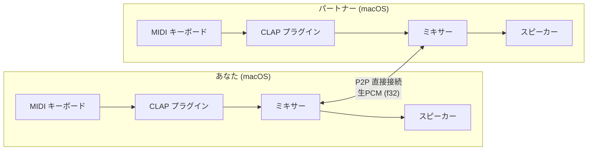
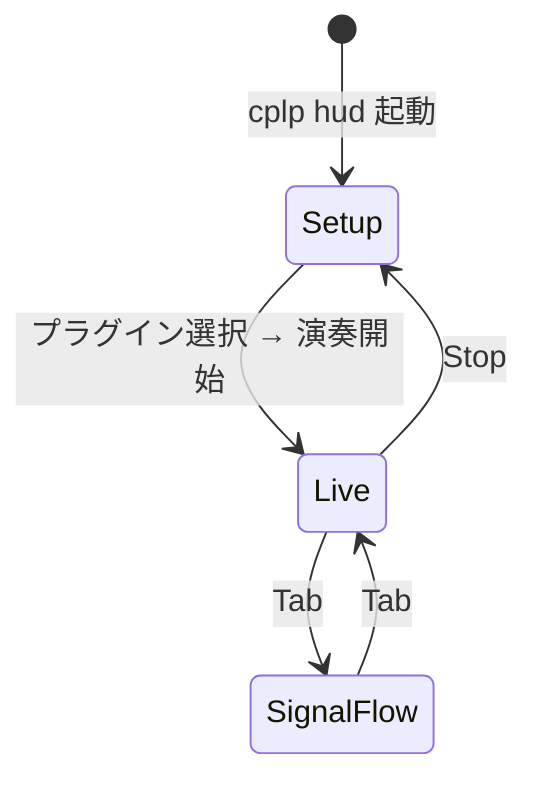
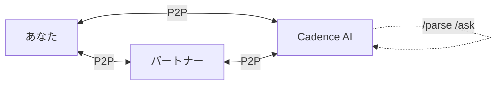
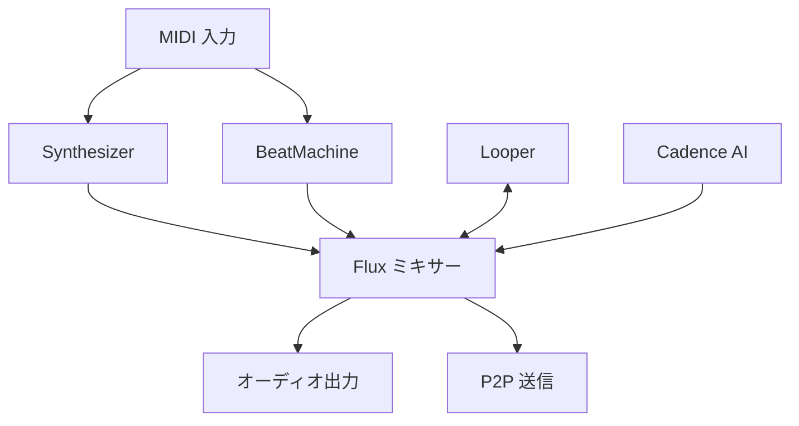
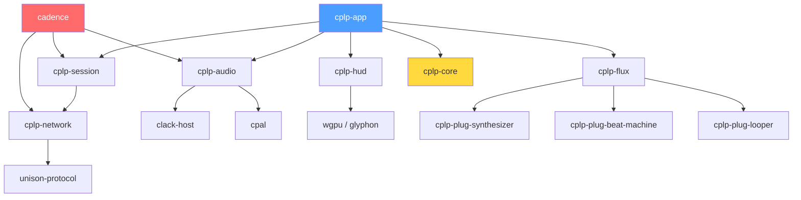

# cplp-sound-system

**2台の Mac を繋いで、離れた場所でリアルタイムジャムセッション。**

CLAP プラグインと MIDI キーボードを使って、友達と P2P で直接つないでリアルタイムに演奏できるアプリ。
ロビーサーバーで簡単に相手を見つけて、まるで同じ部屋にいるみたいにセッションできる。



---

## できること

- **CLAP プラグインで演奏** — Surge XT, Vital, Dexed など無料プラグインがそのまま使える
- **MIDI キーボード接続** — 手持ちの MIDI コントローラーをそのまま接続
- **P2P 直接接続** — サーバーを経由しない低レイテンシ通信（QUIC ベース）
- **ロビーサーバー** — グループ作成 → セッション公開 → ワンコマンドで参加
- **リアルタイム HUD** — 波形・レベルメーター・信号フローを GPU 描画でライブ表示
- **内蔵モジュール** — Synthesizer / BeatMachine / Looper をプラグインなしで使える
- **Cadence（AI バンドメンバー）** — AI がセッションに参加して自律的に演奏

---

## 必要なもの

| 項目 | 要件 |
|------|------|
| OS | macOS 14+ (Sonoma 以降) |
| Rust | 1.85.0+ |
| MIDI キーボード | あれば（なくてもテストノートで演奏可能） |
| CLAP プラグイン | **Surge XT 推奨**（無料・高品質） |

### Surge XT のインストール

**Surge XT** はオープンソースの高品質シンセサイザー。無料で使える。

1. [surge-synthesizer.github.io](https://surge-synthesizer.github.io) からダウンロード
2. `.dmg` を開いてインストーラーを実行
3. CLAP 版が `~/Library/Audio/Plug-Ins/CLAP/` に自動配置される
4. `cplp device scan` で `org.surge-synth-team.surge-xt` として表示される

> **他の無料プラグイン**: [Vital](https://vital.audio)（ウェーブテーブルシンセ）、[Dexed](https://github.com/asb2m10/dexed)（FM シンセ）も CLAP 対応。

---

## Getting Started — 5分で最初の音を出す

### 1. ビルド

```bash
git clone https://github.com/chronista-club/cplp-sound-system.git
cd cplp-sound-system
cargo build
```

### 2. プラグインを確認

```bash
# インストール済み CLAP プラグインをスキャン
cplp device scan
```

出力例:
```
[1] org.surge-synth-team.surge-xt  "Surge XT"
[2] com.vital.synth                "Vital"
```

### 3. MIDI を確認（キーボードがある場合）

```bash
cplp device midi
```

### 4. 音を出す

```bash
# テストノートで鳴らす
cplp play org.surge-synth-team.surge-xt

# MIDI キーボードで演奏（ポート番号は midi コマンドで確認）
cplp play org.surge-synth-team.surge-xt --midi 0

# プラグイン GUI を表示
cplp play org.surge-synth-team.surge-xt --gui

# エフェクトチェイン: シンセ → エフェクト
cplp play org.surge-synth-team.surge-xt --fx <FX_PLUGIN_ID>
```

### 5. HUD を起動

```bash
# インタラクティブ HUD（プラグイン選択 → 演奏まで GUI で操作）
cplp hud
```

HUD は 3 つの画面で構成されていて、`Tab` キーで切り替え:



| 画面 | 内容 |
|------|------|
| **Setup** | プラグイン・MIDI ポートの選択 |
| **Live** | レベルメーター・波形のリアルタイム表示 |
| **SignalFlow** | 信号の流れをグラフ表示 |

---

## ジャムセッションを始める

### 直接接続（同じ LAN / 同一マシン）

ターミナルを 2 つ開いて:

```bash
# ターミナル 1 — ホストとして待機
cplp session listen org.surge-synth-team.surge-xt --port 5000

# ターミナル 2 — 接続（同一マシンならループバック）
cplp session connect [::1]:5000 org.surge-synth-team.surge-xt --port 5001
```

**別の Mac から接続する場合:**

```bash
# ホスト側で IPv6 アドレスを確認
ifconfig en0 | grep inet6

# ゲスト側から接続
cplp session connect "fe80::xxxx:xxxx:xxxx:xxxx%en0":5000 org.surge-synth-team.surge-xt --port 5001
```

> HUD を同時に起動したい場合は `--hud` を付ける:
> ```bash
> cplp session listen org.surge-synth-team.surge-xt --port 5000 --hud
> ```

### ロビー経由（リモート接続）

ロビーサーバーを使えば、IP アドレスを知らなくてもマッチングできる。

```mermaid
sequenceDiagram
    participant H as ホスト
    participant L as ロビーサーバー
    participant G as ゲスト

    G->>L: lobby groups（グループ一覧を取得）
    H->>L: lobby host（セッション公開）
    G->>L: lobby join（セッション参加）
    L-->>H: ゲストの接続情報を通知
    L-->>G: ホストの接続情報を通知
    H<-->G: P2P 直接接続確立
```

```bash
# グループ一覧を見る
cplp session lobby groups

# ホストとしてセッションを公開
cplp session lobby host --group <GROUP_ID> org.surge-synth-team.surge-xt

# セッションに参加
cplp session lobby join --session <SESSION_ID> org.surge-synth-team.surge-xt
```

---

## HUD（ライブ画面）

wgpu で描画されたフルスクラッチの演奏用ダッシュボード。

| 画面 | 内容 | 操作 |
|------|------|------|
| **Setup** | プラグイン一覧 / MIDI ポート選択 | マウスクリックで選択 |
| **Live** | レベルメーター / 波形 / 接続状態 | リアルタイム自動更新 |
| **SignalFlow** | 信号フローグラフ（モジュール接続図） | Tab で切替 |

`cplp hud` で単独起動、またはセッションコマンドに `--hud` を付けて同時起動。

---

## Cadence（AI バンドメンバー）

Cadence は独立バイナリ `cadence` として動作する AI バンドメンバー。
P2P セッションに接続し、自律的に演奏する。



```bash
# ホストとして接続を待機
cadence listen org.surge-synth-team.surge-xt --port 5000

# 指定アドレスに接続
cadence connect [::1]:5000 org.surge-synth-team.surge-xt --port 5001

# 稼働状況を確認
cadence status
```

### セッション中のコマンド

| コマンド | 説明 | 例 |
|---------|------|-----|
| `/parse` | MIDI ノートを直接指定 | `/parse C4 E4 G4 120bpm` |
| `/ask` | 自然言語で演奏指示 | `/ask jazzy chord progression in Cm` |

---

## 内蔵モジュール

プラグインを別途インストールしなくても使えるビルトインモジュール。
Flux エンジンが全モジュールの出力をリアルタイムにミキシング・加工する。



| モジュール | 説明 |
|-----------|------|
| **Synthesizer** | 減算合成方式のシンセ。MIDI ノートでポリフォニック演奏 |
| **BeatMachine** | パターンベースのビートマシン。ステップシーケンサー内蔵 |
| **Looper** | リアルタイム録音 → ループ再生。セッション中のフレーズキャプチャに |

---

<details>
<summary><strong>CLI リファレンス（全コマンド一覧）</strong></summary>

### デバイス確認

```bash
cplp device scan              # CLAP プラグインをスキャン
cplp device midi              # MIDI 入力ポートを一覧
cplp device test --freq 440 --duration 3  # オーディオ出力テスト（サイン波）
```

### プラグイン演奏

```bash
cplp play <PLUGIN_ID>                    # テストノートで再生
cplp play <PLUGIN_ID> --midi 0           # MIDI キーボードで演奏
cplp play <PLUGIN_ID> --fx <FX_ID>       # エフェクトチェイン
cplp play <PLUGIN_ID> --gui              # プラグイン GUI を表示
cplp play <PLUGIN_ID> --duration 10      # 再生時間を指定（秒）
```

### HUD

```bash
cplp hud                                 # インタラクティブ HUD を起動
```

### P2P セッション

```bash
cplp session listen <PLUGIN_ID> --port 5000        # ホストとして待機
cplp session connect <ADDR> <PLUGIN_ID> --port 5001 # ピアに接続
cplp session listen <PLUGIN_ID> --port 5000 --hud   # HUD 同時起動
```

### ロビー

```bash
cplp session lobby groups                                   # グループ一覧
cplp session lobby host --group <GID> <PLUGIN_ID>           # セッション公開
cplp session lobby join --session <SID> <PLUGIN_ID>         # セッション参加
```

### Cadence

```bash
cadence listen <PLUGIN_ID> --port 5000              # ホスト待機
cadence connect <ADDR> <PLUGIN_ID> --port 5001      # 接続
cadence status                                       # 稼働状況
```

### ログ

```bash
cplp play <PLUGIN_ID> --log-file cplp.log           # ファイルにログ出力
CPLP_LOG=dev cplp device scan                        # debug + audio trace
CPLP_LOG=audio cplp play <PLUGIN_ID>                 # オーディオ系 trace
CPLP_LOG=network cplp session listen                 # ネットワーク系 debug
CPLP_LOG=production cplp play <PLUGIN_ID>            # warn 以上のみ
```

</details>

---

<details>
<summary><strong>アーキテクチャ</strong></summary>

### クレート構成

12 のクレートで構成される Cargo ワークスペース:

| クレート | 役割 |
|---------|------|
| **cplp-app** | CLI アプリケーション（`cplp` バイナリ） |
| **cplp-core** | 共通型定義・AudioModule トレイト |
| **cplp-audio** | オーディオエンジン（CLAP ホスティング + cpal + Mixer） |
| **cplp-network** | P2P ネットワーク層（Unison Protocol / QUIC） |
| **cplp-session** | セッション管理・シグナリング |
| **cplp-lobby** | ロビーサーバー（Axum + SurrealDB） |
| **cplp-hud** | ライブ演奏向け HUD（wgpu 直上フルスクラッチ） |
| **cplp-cadence** | Cadence — AI バンドメンバー（独立バイナリ `cadence`） |
| **cplp-flux** | Flux — モジュール統合・ミキシングエンジン |
| **cplp-plug-synthesizer** | 内蔵シンセサイザー |
| **cplp-plug-beat-machine** | 内蔵ビートマシン |
| **cplp-plug-looper** | 内蔵ルーパー |

### 依存関係



### 技術スタック

| 層 | 技術 | 用途 |
|----|------|------|
| 言語 | Rust (edition 2024) | システムプログラミング・リアルタイム処理 |
| オーディオ I/O | cpal | クロスプラットフォームオーディオ入出力 |
| プラグインホスト | clack-host | CLAP プラグインホスティング |
| MIDI | midir | MIDI 入力 |
| ネットワーク | Unison Protocol (QUIC) | P2P 通信 |
| GPU レンダリング | wgpu + glyphon | HUD 描画 |
| 非同期ランタイム | tokio | ネットワーク・制御の非同期処理 |
| ロビーサーバー | axum + SurrealDB | セッション仲介 |

### 設計ドキュメント

| ドキュメント | 内容 |
|-------------|------|
| [spec/01-core-concept.md](spec/01-core-concept.md) | コアコンセプト・要件定義 |
| [spec/02-audio-pipeline.md](spec/02-audio-pipeline.md) | オーディオパイプライン仕様 |
| [spec/03-p2p-protocol.md](spec/03-p2p-protocol.md) | P2P プロトコル仕様 |
| [design/01-architecture.md](design/01-architecture.md) | 全体アーキテクチャ設計 |
| [design/02-p2p-connection.md](design/02-p2p-connection.md) | P2P 接続設計 |

</details>

---

## 開発に参加する

```bash
# ビルド
cargo build

# テスト
cargo test --workspace

# Lint
cargo clippy --workspace -- -D warnings
```

詳細: [guides/01-getting-started.md](guides/01-getting-started.md)

---

## トラブルシューティング

| 症状 | 原因 | 対処 |
|------|------|------|
| ビルドで `edition 2024 not supported` | Rust が古い | `rustup update` で 1.85+ に更新 |
| `cplp device scan` でプラグインが出ない | CLAP 未インストール | `~/Library/Audio/Plug-Ins/CLAP/` にプラグインを配置 |
| 音が出ない | 出力デバイス未選択 | macOS の音声設定でデバイスを確認 |
| ノイズ・グリッチが出る | バッファサイズが小さい | バッファサイズを 256 に増やす |
| 接続できない | ファイアウォール | macOS ファイアウォールで UDP を許可 |
| IPv6 エラー | IPv6 無効 | ネットワーク設定で IPv6 を確認 |

---

## ライセンス

MIT
