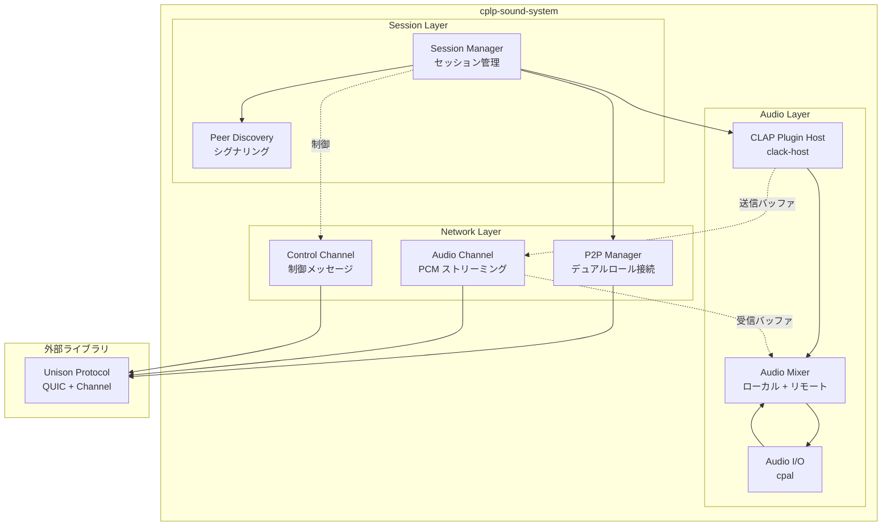
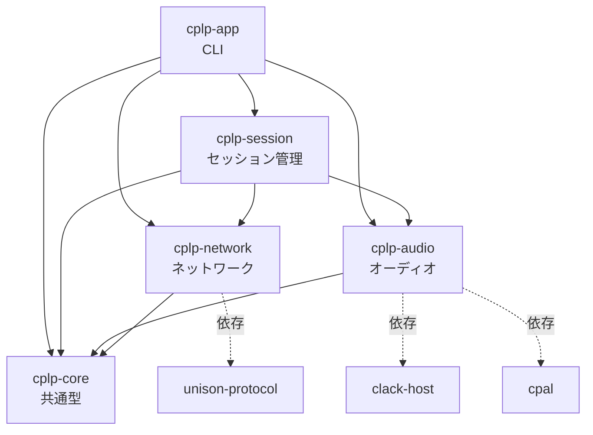
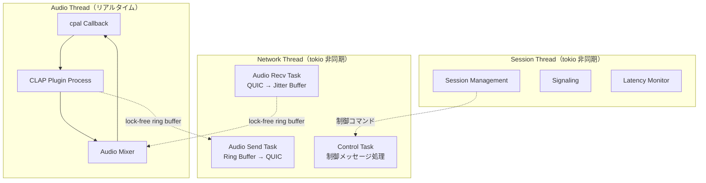
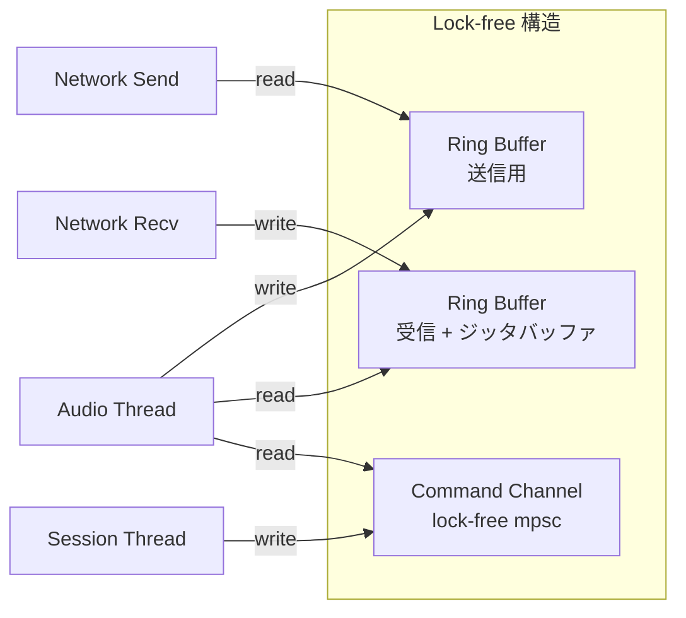
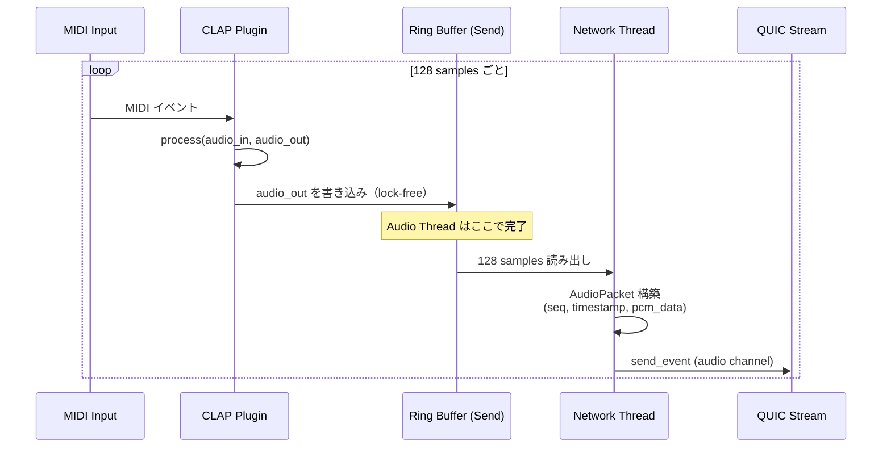
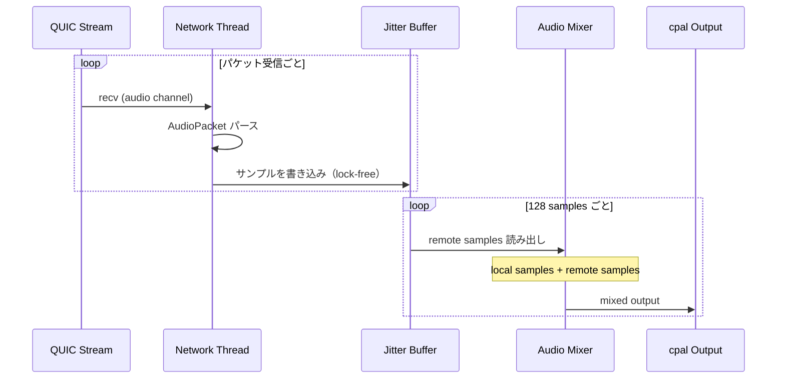
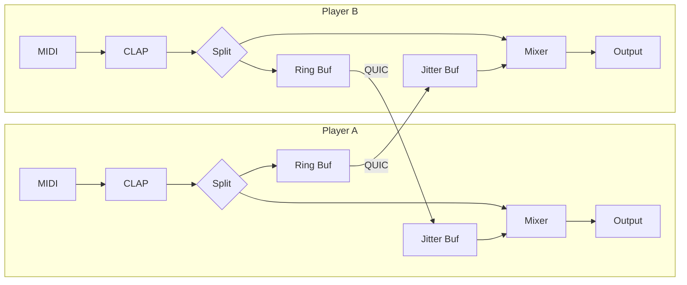

# design/01: 全体アーキテクチャ設計

**バージョン**: 0.1.0-draft
**最終更新**: 2026-02-20
**ステータス**: Draft

---

## 目次

1. [概要](#1-概要)
2. [レイヤー構成](#2-レイヤー構成)
3. [クレート構成](#3-クレート構成)
4. [スレッド構成](#4-スレッド構成)
5. [データフロー](#5-データフロー)
6. [依存クレート](#6-依存クレート)
7. [要件トレーサビリティ](#7-要件トレーサビリティ)

---

## 1. 概要

cplp-sound-system は、3 つのレイヤー（Session / Audio / Network）と Unison Protocol ライブラリで構成される。各レイヤーは独立したクレートとして分離し、リアルタイムオーディオ処理とネットワーク通信のスレッドを明確に分ける。

---

## 2. レイヤー構成



### 2.1 レイヤー責務

| レイヤー | 責務 | 主要構造体 |
|---------|------|-----------|
| **Session** | セッションライフサイクル管理、ピアディスカバリー | `SessionManager`, `PeerDiscovery` |
| **Audio** | CLAP ホスティング、ミキシング、オーディオ I/O | `PluginHost`, `AudioMixer`, `AudioEngine` |
| **Network** | P2P 接続管理、チャネル通信 | `P2pManager`, `AudioStreamer`, `ControlHandler` |

---

## 3. クレート構成

### 3.1 ワークスペース構成

```
cplp-sound-system/
├── Cargo.toml                    # ワークスペースルート
├── crates/
│   ├── cplp-core/                # 共通型定義、設定
│   │   └── src/lib.rs
│   ├── cplp-audio/               # オーディオエンジン（CLAP + cpal + Mixer）
│   │   └── src/
│   │       ├── lib.rs
│   │       ├── engine.rs         # AudioEngine: cpal コールバック管理
│   │       ├── plugin_host.rs    # PluginHost: clack-host ラッパー
│   │       └── mixer.rs          # AudioMixer: ローカル + リモートミキシング
│   ├── cplp-network/             # P2P ネットワーク層
│   │   └── src/
│   │       ├── lib.rs
│   │       ├── p2p.rs            # P2pManager: デュアルロール接続
│   │       ├── audio_channel.rs  # AudioStreamer: PCM 送受信
│   │       └── control.rs        # ControlHandler: 制御メッセージ
│   ├── cplp-session/             # セッション管理
│   │   └── src/
│   │       ├── lib.rs
│   │       ├── manager.rs        # SessionManager: ライフサイクル管理
│   │       └── signaling.rs      # PeerDiscovery: シグナリング
│   └── cplp-app/                 # CLI アプリケーション
│       └── src/
│           └── main.rs
├── schemas/
│   └── cplp-session.kdl          # Unison プロトコルスキーマ
├── spec/
├── design/
└── guides/
```

### 3.2 クレート依存関係



### 3.3 ワークスペース共通設定

| 設定 | 値 |
|------|-----|
| edition | 2024 |
| rust-version | 1.85.0 |
| version | 0.1.0 |
| resolver | 2 |

---

## 4. スレッド構成

### 4.1 スレッドモデル



### 4.2 リアルタイム制約

| スレッド | 制約 | 許可される操作 | 禁止される操作 |
|---------|------|--------------|--------------|
| Audio Thread | リアルタイム | メモリ読み書き、lock-free 操作 | メモリ確保、ロック、I/O、システムコール |
| Network Thread | なし | すべて | - |
| Session Thread | なし | すべて | - |

### 4.3 スレッド間通信



---

## 5. データフロー

### 5.1 送信パス



### 5.2 受信パス



### 5.3 全体データフロー



---

## 6. 依存クレート

### 6.1 直接依存

| クレート | バージョン | 用途 | 使用クレート |
|---------|-----------|------|------------|
| `unison-protocol` | git | QUIC 通信、チャネル管理 | cplp-network |
| `clack-host` | 0.1.x | CLAP プラグインホスティング | cplp-audio |
| `cpal` | 0.15.x | オーディオ I/O | cplp-audio |
| `tokio` | 1.x | 非同期ランタイム | cplp-network, cplp-session |
| `ringbuf` | 0.4.x | lock-free ring buffer | cplp-audio, cplp-network |
| `serde` / `serde_json` | 1.x | シリアライゼーション | cplp-core |
| `clap` (CLI) | 4.x | CLI 引数パース | cplp-app |
| `tracing` | 0.1.x | ロギング | 全クレート |
| `anyhow` | 1.x | エラーハンドリング | 全クレート |

### 6.2 間接依存（Unison 経由）

| クレート | 用途 |
|---------|------|
| `quinn` | QUIC 実装 |
| `rustls` | TLS 1.3 |
| `rkyv` | ゼロコピーシリアライゼーション |

---

## 7. 要件トレーサビリティ

| REQ-ID | 設計上の対応 |
|--------|------------|
| REQ-CORE-001 | セクション 5: フルデュプレックスデータフロー |
| REQ-CORE-002 | セクション 4: リアルタイムスレッド + lock-free 通信 |
| REQ-CORE-003 | セクション 5: 生 PCM データフロー |
| REQ-AUDIO-001 | セクション 3: cplp-audio クレート（clack-host） |
| REQ-AUDIO-002 | セクション 5: Split による同時処理 |
| REQ-AUDIO-003 | セクション 5: Audio Mixer |
| REQ-NET-001 | セクション 2: Network Layer（デュアルロール P2P） |
| REQ-NET-002 | セクション 3: cplp-session（シグナリング） |
| REQ-NET-003 | セクション 2: チャネル分離 |
| REQ-SESSION-001 | セクション 3: cplp-session クレート |
| REQ-SESSION-002 | セクション 3: cplp-audio（プラグイン切り替え） |

---

### 関連ドキュメント

- [spec/01: コアコンセプト](../spec/01-core-concept.md) -- 要件定義
- [spec/02: オーディオパイプライン](../spec/02-audio-pipeline.md) -- オーディオ仕様
- [spec/03: P2P プロトコル](../spec/03-p2p-protocol.md) -- ネットワーク仕様
- [design/02: P2P 接続設計](02-p2p-connection.md) -- デュアルロール P2P の実装設計

---

**設計バージョン**: 0.1.0-draft
**最終更新**: 2026-02-20
**ステータス**: Draft
