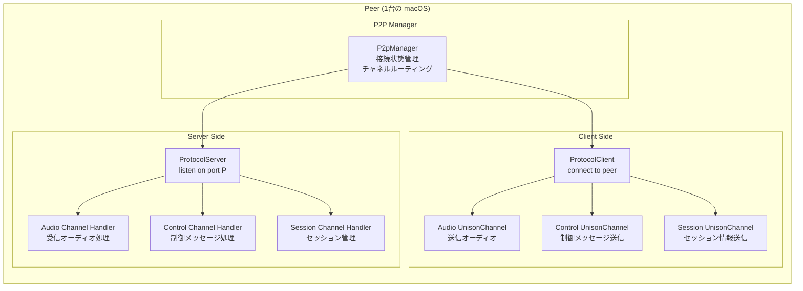
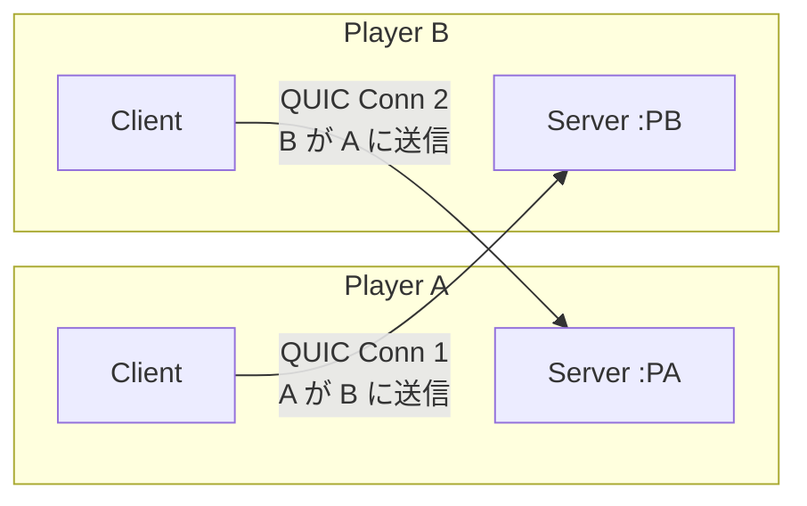
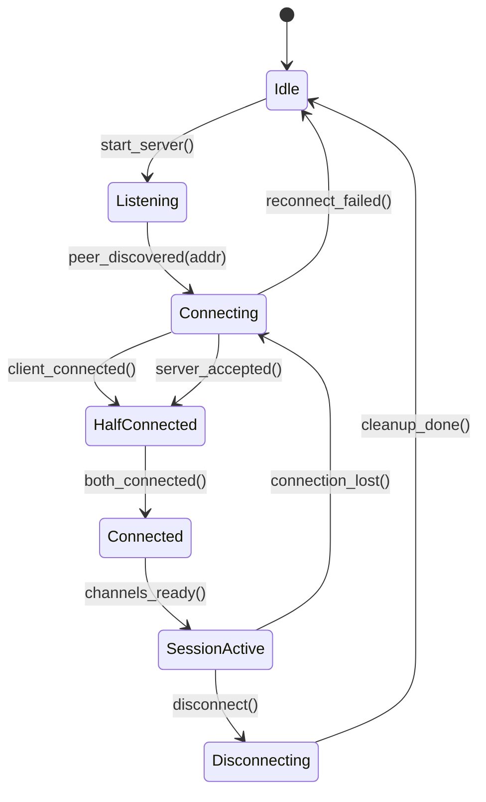
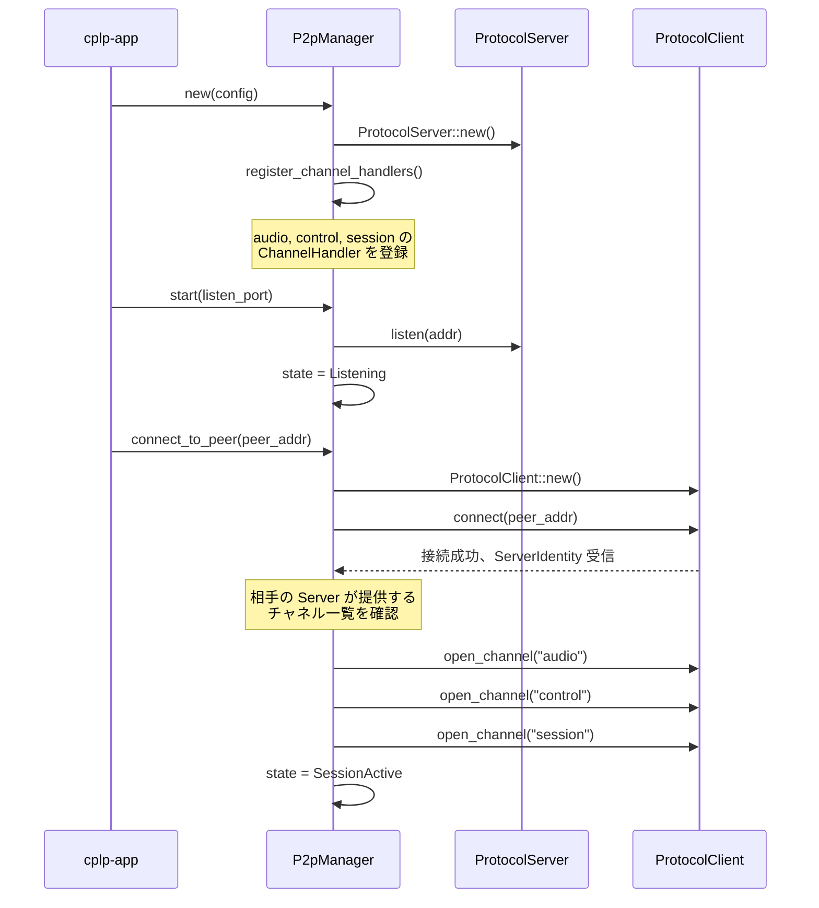
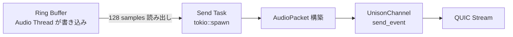
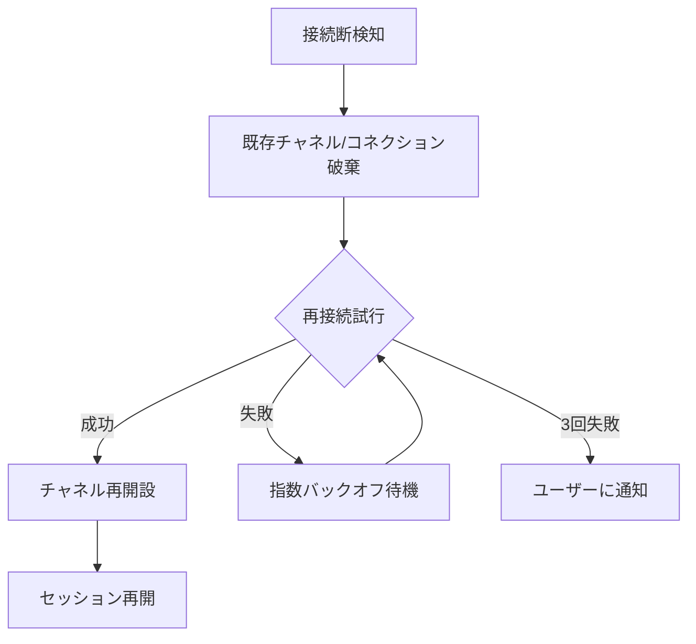

# design/02: P2P 接続設計（デュアルロール構成）

**バージョン**: 0.1.0-draft
**最終更新**: 2026-02-20
**ステータス**: Draft

---

## 目次

1. [概要](#1-概要)
2. [デュアルロールアーキテクチャ](#2-デュアルロールアーキテクチャ)
3. [P2pManager の設計](#3-p2pmanager-の設計)
4. [接続確立の実装](#4-接続確立の実装)
5. [チャネルハンドラーの実装](#5-チャネルハンドラーの実装)
6. [オーディオストリーミングの実装](#6-オーディオストリーミングの実装)
7. [エラーハンドリングと再接続](#7-エラーハンドリングと再接続)
8. [要件トレーサビリティ](#8-要件トレーサビリティ)

---

## 1. 概要

本設計書では、Unison Protocol をライブラリとして使い、cplp-sound-system 内で P2P 接続を実現する方法を定義する。核心は **デュアルロール**（各ピアが ProtocolServer + ProtocolClient を同時に持つ）構成にある。

### 1.1 設計判断

| 判断 | 選択 | 理由 |
|------|------|------|
| P2P の実装場所 | cplp-sound-system 内 | Unison Protocol は汎用ライブラリとして保ち、拡張しない |
| 接続モデル | デュアルロール | Unison の既存 Server/Client API をそのまま使える |
| コネクション数 | 2本/ピアペア | 各方向に 1 本の QUIC コネクション |

---

## 2. デュアルロールアーキテクチャ

### 2.1 各ピアの内部構造



### 2.2 2 ピア間のコネクション構造



**データの流れ**:
- **A の演奏音 → B に届く**: A:Client → B:Server (audio channel)
- **B の演奏音 → A に届く**: B:Client → A:Server (audio channel)

各コネクションは 3 つのチャネル（audio, control, session）を持つ。

---

## 3. P2pManager の設計

### 3.1 構造体設計

```rust
/// P2P 接続を管理する中心的な構造体
pub struct P2pManager {
    /// Unison ProtocolServer インスタンス
    server: ProtocolServer,
    /// Unison ProtocolClient インスタンス（相手に接続後に保持）
    client: Option<ProtocolClient>,
    /// 接続状態
    state: P2pState,
    /// 相手のピア情報
    peer_info: Option<PeerInfo>,
    /// オーディオ送信チャネル（Client 側で開設）
    audio_channel: Option<UnisonChannel>,
    /// コントロールチャネル
    control_channel: Option<UnisonChannel>,
    /// セッションチャネル
    session_channel: Option<UnisonChannel>,
}

pub struct PeerInfo {
    pub addr: SocketAddr,
    pub name: String,
    pub server_identity: Option<ServerIdentity>,
}

pub enum P2pState {
    Idle,
    Listening,        // Server のみ起動
    Connecting,       // Client 接続中
    HalfConnected,    // 片方向のみ接続
    Connected,        // 双方向接続完了
    SessionActive,    // チャネル開設完了、オーディオストリーミング中
    Disconnecting,
}
```

### 3.2 状態遷移



---

## 4. 接続確立の実装

### 4.1 起動シーケンス



### 4.2 同時接続のハンドリング

両ピアが同時に `connect_to_peer()` を呼ぶ場合、Server 側で相手の接続を受け付けつつ、Client 側で相手に接続する。

```rust
/// 並行して Server 受付と Client 接続を行う
async fn establish_connection(&mut self, peer_addr: SocketAddr) -> Result<()> {
    // Server は既に listen 中

    // Client 接続を試行（相手の Server に接続）
    let client = ProtocolClient::new();
    client.connect(peer_addr).await?;

    // ServerIdentity から相手のチャネル一覧を確認
    let identity = client.server_identity();

    // チャネルを開設
    self.audio_channel = Some(client.open_channel("audio").await?);
    self.control_channel = Some(client.open_channel("control").await?);
    self.session_channel = Some(client.open_channel("session").await?);

    self.client = Some(client);
    self.state = P2pState::SessionActive;

    Ok(())
}
```

---

## 5. チャネルハンドラーの実装

### 5.1 Server 側チャネルハンドラー

Server 側では、相手の Client からの接続を受け付け、チャネルごとにハンドラーを実行する。

```rust
fn register_channel_handlers(server: &mut ProtocolServer) {
    // audio チャネル: 相手のオーディオを受信
    server.register_channel("audio", |ctx, stream| {
        Box::pin(handle_audio_recv(ctx, stream))
    });

    // control チャネル: 制御メッセージを処理
    server.register_channel("control", |ctx, stream| {
        Box::pin(handle_control(ctx, stream))
    });

    // session チャネル: セッション情報を処理
    server.register_channel("session", |ctx, stream| {
        Box::pin(handle_session(ctx, stream))
    });
}
```

### 5.2 チャネルデータフローまとめ

| チャネル | Client 側（自分→相手） | Server 側（相手→自分） |
|---------|----------------------|----------------------|
| audio | 自分の PCM を送信 | 相手の PCM を受信 → Jitter Buffer |
| control | パラメータ変更要求、レイテンシレポート送信 | パラメータ変更要求を処理 |
| session | プラグイン情報、状態通知 | 相手のプラグイン情報を受信 |

---

## 6. オーディオストリーミングの実装

### 6.1 送信パス（Client 側）



```rust
async fn audio_send_loop(
    channel: &UnisonChannel,
    ring_buf: &Consumer<f32>,
) -> Result<()> {
    let mut seq: u32 = 0;
    let mut buf = vec![0f32; BUFFER_SIZE * CHANNELS];

    loop {
        // Ring buffer から 128 × 2ch サンプル読み出し
        let read = ring_buf.read(&mut buf);
        if read < buf.len() {
            // バッファ不足: 次のサイクルを待つ
            tokio::time::sleep(Duration::from_micros(500)).await;
            continue;
        }

        // AudioPacket を構築して送信
        let packet = AudioPacket { seq, ts: timestamp(), pcm_data: &buf };
        channel.send_event("audio", packet.to_bytes()).await?;
        seq = seq.wrapping_add(1);
    }
}
```

### 6.2 受信パス（Server 側ハンドラー）

```rust
async fn handle_audio_recv(
    _ctx: ConnectionContext,
    mut channel: UnisonChannel,
    jitter_buf: &Producer<f32>,
) -> Result<()> {
    loop {
        let msg = channel.recv().await?;
        let packet = AudioPacket::from_bytes(&msg.payload)?;

        // Jitter buffer に書き込み（lock-free）
        jitter_buf.write(&packet.pcm_data);
    }
}
```

---

## 7. エラーハンドリングと再接続

### 7.1 接続断の検知

| 検知方法 | 対象 |
|---------|------|
| QUIC idle timeout | 60 秒間通信なし |
| Stream error | QUIC ストリームエラー |
| Heartbeat | control チャネルの LatencyReport が途絶 |

### 7.2 再接続戦略



| パラメータ | 値 |
|-----------|-----|
| 初回再接続待機 | 1 秒 |
| バックオフ係数 | 2x |
| 最大再接続回数 | 3 回 |
| 最大待機時間 | 8 秒 |

### 7.3 グレースフル切断

```rust
async fn disconnect(&mut self) -> Result<()> {
    // 1. 相手に切断を通知
    if let Some(ch) = &self.session_channel {
        ch.send_event("PeerStatus", json!({"status": "disconnecting"})).await.ok();
    }

    // 2. チャネルを閉じる
    for ch in [&mut self.audio_channel, &mut self.control_channel, &mut self.session_channel] {
        if let Some(c) = ch.take() {
            c.close().await.ok();
        }
    }

    // 3. Client 切断
    if let Some(client) = self.client.take() {
        client.disconnect().await.ok();
    }

    // 4. Server 停止
    self.server.stop().await?;
    self.state = P2pState::Idle;

    Ok(())
}
```

---

## 8. 要件トレーサビリティ

| REQ-ID | 設計上の対応 |
|--------|------------|
| REQ-NET-001 | セクション 2, 3: デュアルロール P2P 接続 |
| REQ-NET-002 | セクション 4: シグナリング経由の接続確立 |
| REQ-NET-003 | セクション 5: チャネルハンドラー分離 |
| REQ-CORE-001 | セクション 6: フルデュプレックスオーディオストリーミング |
| REQ-SESSION-001 | セクション 4: 接続確立シーケンス |

---

### 関連ドキュメント

- [spec/03: P2P プロトコル仕様](../spec/03-p2p-protocol.md) -- P2P 通信の仕様
- [design/01: アーキテクチャ](01-architecture.md) -- 全体設計
- [Unison Protocol: アーキテクチャ設計](https://github.com/mako-357/unison/blob/main/design/architecture.md) -- Unison の Server/Client API

---

**設計バージョン**: 0.1.0-draft
**最終更新**: 2026-02-20
**ステータス**: Draft
