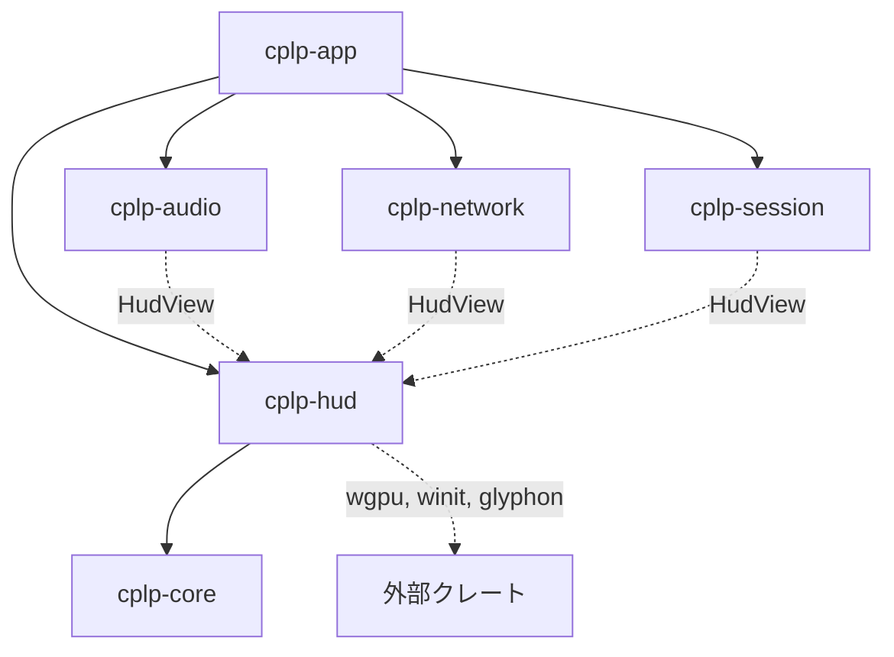
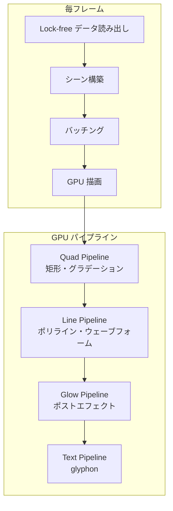
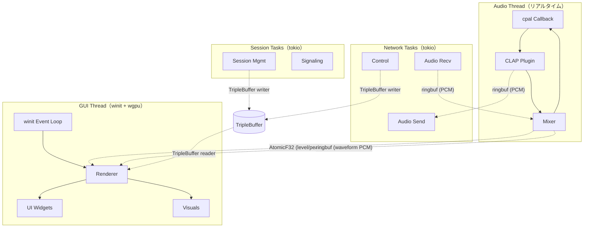

# cplp-hud GUI 設計

**日付**: 2026-02-22
**ステータス**: Approved
**概要**: ライブ演奏向け HUD を wgpu 直上でフルスクラッチ構築する設計

---

## 背景

cplp-sound-system は現在 CLI のみ。ライブ演奏中に接続状態・レベル・プラグイン情報を確認し、ウェーブフォームやスペクトラム等のリッチなビジュアルも表示する GUI が必要。

### 検討した選択肢

| 選択肢 | 判定 | 理由 |
|---|---|---|
| Fabric (Swift) | 見送り | クリエイティブコーディング環境であり UI フレームワークではない。Rust との FFI コスト |
| SwiftUI + Rust FFI | 見送り | ネイティブ体験は良いが FFI ブリッジの実装コストが高い |
| nannou + egui | 見送り | 既存フレームワーク依存。描画とUIの制御が制限される |
| egui 単体 (eframe) | 見送り | 軽量だがカスタム描画（ウェーブフォーム、グロー等）に限界がある |
| **wgpu 直上フルスクラッチ** | **採用** | 完全な描画制御。ビジュアル層とUI層を自作し、将来汎用ライブラリ化も視野 |

### 設計思想

- **wgpu + winit** をベースに、ビジュアル層と UI 層を自前で構築
- テキスト描画のみ **glyphon**（cosmic-text ベース）を採用
- 将来的に cplp 以外でも再利用できる汎用レンダリングエンジン/UI ツールキットへの発展を視野に入れる

---

## 1. 技術スタック

| レイヤー | 方針 | クレート |
|---|---|---|
| ウィンドウ管理 | 既存ライブラリ | `winit` |
| GPU 抽象化 | 既存ライブラリ | `wgpu`（Metal バックエンド） |
| テキスト描画 | 既存ライブラリ | `glyphon`（cosmic-text ベース） |
| 2D レンダラー | **自作** | 矩形、線、ポリライン、グラデーション |
| シェーダー | **自作 WGSL** | グロー、ブラー、スペクトラムエフェクト |
| UI ウィジェット | **自作** | ボタン、スライダー、リスト、テキスト入力 |
| レイアウトエンジン | **自作** | 要素配置、サイズ計算 |
| イベント処理 | **自作** | ヒットテスト、フォーカス管理 |

---

## 2. クレート構成

`cplp-hud` クレートをワークスペースに追加。

```
crates/cplp-hud/
└── src/
    ├── lib.rs
    ├── app.rs               # winit イベントループ + 画面遷移
    ├── state.rs             # HudView, AudioMeters, SessionSnapshot
    ├── renderer/            # 2D レンダラー（wgpu）
    │   ├── mod.rs
    │   ├── pipeline.rs      # wgpu レンダーパイプライン管理
    │   ├── primitives.rs    # 矩形、線、ポリライン、円
    │   ├── text.rs          # glyphon ラッパー
    │   └── shaders/         # WGSL シェーダー
    │       ├── quad.wgsl        # 矩形 + グラデーション
    │       ├── line.wgsl        # ライン描画
    │       └── glow.wgsl        # グローエフェクト
    ├── ui/                  # UI ウィジェット（自作）
    │   ├── mod.rs
    │   ├── widget.rs        # Widget トレイト定義
    │   ├── layout.rs        # レイアウトエンジン
    │   ├── event.rs         # イベント処理、ヒットテスト
    │   ├── button.rs        # ボタン
    │   ├── slider.rs        # スライダー（ミックスバランス用）
    │   ├── text_input.rs    # テキスト入力（セッション ID 用）
    │   └── list.rs          # リスト（プラグイン・MIDI 選択用）
    └── visuals/             # ビジュアル描画（自作）
        ├── mod.rs
        ├── waveform.rs      # ウェーブフォーム描画
        ├── spectrum.rs      # スペクトラム描画
        ├── meters.rs        # リッチなレベルメーター（グロー付き）
        └── connection.rs    # 接続状態インジケーター
```

### クレート依存関係



---

## 3. レンダリングアーキテクチャ

### 3.1 描画パイプライン



### 3.2 レンダーパイプライン構成

| パイプライン | 用途 | 入力 |
|---|---|---|
| **Quad** | 矩形、メーターバー、背景、グラデーション | 頂点バッファ（pos, color, uv） |
| **Line** | ポリライン、ウェーブフォーム | 頂点バッファ（pos, color, thickness） |
| **Glow** | グローエフェクト（ポストプロセス） | レンダーテクスチャ → ブラー → 加算合成 |
| **Text** | テキスト描画 | glyphon TextRenderer |

### 3.3 描画 API（設計イメージ）

```rust
// renderer/primitives.rs

pub struct Renderer { /* wgpu state */ }

impl Renderer {
    /// 矩形描画（角丸、グラデーション対応）
    pub fn rect(&mut self, rect: Rect, style: RectStyle);

    /// ポリライン描画（ウェーブフォーム等）
    pub fn polyline(&mut self, points: &[Vec2], style: LineStyle);

    /// テキスト描画
    pub fn text(&mut self, text: &str, pos: Vec2, style: TextStyle);

    /// グローエフェクト付き矩形
    pub fn glow_rect(&mut self, rect: Rect, style: GlowStyle);

    /// フレーム確定・GPU 送信
    pub fn flush(&mut self, encoder: &mut wgpu::CommandEncoder);
}

pub struct RectStyle {
    pub color: Color,
    pub gradient: Option<Gradient>,
    pub corner_radius: f32,
}

pub struct LineStyle {
    pub color: Color,
    pub thickness: f32,
}

pub struct GlowStyle {
    pub color: Color,
    pub intensity: f32,
    pub radius: f32,
}
```

---

## 4. UI システム

### 4.1 Widget トレイト

```rust
// ui/widget.rs

pub trait Widget {
    /// レイアウト計算（希望サイズを返す）
    fn layout(&mut self, available: Vec2) -> Vec2;

    /// 描画
    fn draw(&self, renderer: &mut Renderer, rect: Rect);

    /// イベント処理
    fn event(&mut self, event: &UiEvent, rect: Rect) -> EventResponse;
}

pub enum UiEvent {
    MouseMove(Vec2),
    MouseDown(Vec2, MouseButton),
    MouseUp(Vec2, MouseButton),
    Scroll(Vec2),
    KeyDown(Key),
    TextInput(String),
}

pub enum EventResponse {
    Ignored,
    Consumed,
}
```

### 4.2 レイアウトモデル

シンプルなボックスレイアウト。Flexbox のサブセット。

```rust
// ui/layout.rs

pub enum Layout {
    /// 縦積み
    VStack { spacing: f32, children: Vec<Box<dyn Widget>> },
    /// 横並び
    HStack { spacing: f32, children: Vec<Box<dyn Widget>> },
    /// パディング付き
    Padded { padding: Edges, child: Box<dyn Widget> },
    /// 固定サイズ
    Fixed { size: Vec2, child: Box<dyn Widget> },
}
```

---

## 5. データフロー

コア → HUD のデータは **lock-free の一方通行**。リアルタイムオーディオスレッドをブロックしない。

### 3 つのデータ転送パターン

| パターン | データの性質 | 構造 | クレート |
|---|---|---|---|
| ストリーム | PCM オーディオ連続データ | Ring Buffer | `ringbuf` 0.4（既存） |
| 最新値 | レベル・ピーク値 | AtomicF32 | `atomic_float` 1.x |
| スナップショット | セッション情報まるごと | Triple Buffer | `triple_buffer` 8.x |

### データフロー図

```
Audio Thread ──→ [AtomicF32] ─────────────────→ HUD (wgpu)
                  (level, peak)

Audio Thread ──→ [ringbuf] ───────────────────→ HUD (wgpu)
                  (PCM waveform samples)

Network Task ──→ ┐
Session Task ──→ ├→ [TripleBuffer<SessionSnapshot>] ──→ HUD
Audio Thread ──→ ┘    (latency, jitter, peer, plugin, mix)
```

**設計判断: なぜ 3 段構成か**

- `AtomicF32`: レベルメーター。`store(val, Relaxed)` 1 命令。最速パス
- `ringbuf`: ウェーブフォーム描画用の PCM サンプル履歴。リングバッファで直近 N サンプルを保持
- `TripleBuffer<SessionSnapshot>`: セッション情報。読み出し時に更新がなければ atomic 操作ゼロ（wait-free）

---

## 6. データ構造

```rust
// cplp-hud/src/state.rs

use atomic_float::AtomicF32;
use std::sync::Arc;
use triple_buffer::Output;

/// オーディオスレッドから直接書き込まれる（最速パス）
pub struct AudioMeters {
    pub local_level: AtomicF32,
    pub local_peak: AtomicF32,
    pub remote_level: AtomicF32,
    pub remote_peak: AtomicF32,
}

/// ネットワーク/セッション → HUD（triple buffer 経由）
pub struct SessionSnapshot {
    pub peer_name: String,
    pub connected: bool,
    pub latency_ms: f32,
    pub jitter_ms: f32,
    pub local_plugin: String,
    pub remote_plugin: String,
    pub mix_local: f32,
    pub mix_remote: f32,
}

/// HUD が毎フレーム読み出す統合ビュー
pub struct HudView {
    pub meters: Arc<AudioMeters>,
    pub waveform: ringbuf::Consumer<f32>,
    pub session: Output<SessionSnapshot>,
}
```

---

## 7. HUD レイアウト

### Live 画面（リッチ版）

暗い背景にグロー付きインジケーター。ウェーブフォームとスペクトラムをリアルタイム描画。

```
┌─────────────────────────────────────────────────┐
│                                                 │
│   ● Player B                          8.2ms    │
│   Jitter: 2.1ms                                │
│                                                 │
│   ├ You ──────────────────────────────────────  │
│   │  ▁▂▃▅▇█▇▅▃▂▁▁▂▃▅  Diva          -6dB    │
│   │  (waveform + glow)                         │
│   │                                             │
│   ├ Peer ─────────────────────────────────────  │
│   │  ▁▁▂▃▅▃▂▁▁▁▂▃▂▁▁  Vital         -12dB   │
│   │  (waveform + glow)                         │
│   │                                             │
│   ├ Spectrum ─────────────────────────────────  │
│   │  █▓▒░   ░▒▓█▓▒░   ░▒▓█                   │
│   │  (frequency spectrum + glow)               │
│   │                                             │
│   ├ Mix ──────────────────────────────────────  │
│   │  You ████████████████████░░░░░░ Peer       │
│   │              70% / 30%                      │
│   │                                             │
│   └─────────────────────────────────────────    │
│                                                 │
└─────────────────────────────────────────────────┘
```

### デザインルール

| ルール | 理由 |
|---|---|
| 暗背景（ほぼ黒） | ステージ・暗所で眩しくない |
| 接続状態は色で判断（緑●/赤●） | テキストを読まなくてもわかる |
| ウェーブフォーム + グローエフェクト | 音の動きを視覚的に表現 |
| レイテンシは数値＋色（<10ms 緑、<20ms 黄、>20ms 赤） | 閾値を超えたら色で警告 |
| フォントは大きめモノスペース | 遠くからでも読める |
| 操作要素は最小限 | ライブ中に誤操作しない |

**操作**: ミックスバランスの調整だけ HUD 上で操作可能（ドラッグまたはスクロール）。

---

## 8. 画面遷移

同一ウィンドウ内で 3 つの画面を切り替える。

```
Setup ──[Join/Create]──→ Connecting ──[P2P 確立]──→ Live
  ↑                                                   │
  └──────────────[切断/エラー]─────────────────────────┘
```

```rust
pub enum Screen {
    Setup,       // プラグイン選択、セッション作成/参加
    Connecting,  // P2P 接続待ち
    Live,        // ライブ HUD（演奏中）
}
```

### Setup 画面

- CLAP プラグイン一覧（`clack-finder` でスキャン）→ 自作 List ウィジェット
- セッション作成 or 参加 → 自作 Button + TextInput ウィジェット
- MIDI 入力デバイス選択 → 自作 List ウィジェット

### Connecting 画面

- 接続先ピア名、セッション ID
- アニメーションインジケーター（wgpu で描画）
- キャンセルボタン

### Live 画面

- セクション 7 の HUD レイアウト

---

## 9. メインループ

```rust
// cplp-hud/src/app.rs

use winit::event_loop::EventLoop;
use winit::window::WindowBuilder;

pub struct CplpApp {
    renderer: Renderer,
    screen: Screen,
    view: HudView,
}

impl CplpApp {
    pub fn run(view: HudView) {
        let event_loop = EventLoop::new().unwrap();
        let window = WindowBuilder::new()
            .with_title("cplp")
            .with_inner_size(winit::dpi::LogicalSize::new(640.0, 480.0))
            .build(&event_loop)
            .unwrap();

        // wgpu 初期化
        let renderer = Renderer::new(&window);

        let mut app = CplpApp {
            renderer,
            screen: Screen::Setup,
            view,
        };

        event_loop.run(move |event, target| {
            match event {
                Event::WindowEvent { event, .. } => app.handle_event(event),
                Event::AboutToWait => window.request_redraw(),
                _ => {}
            }
        });
    }

    fn handle_event(&mut self, event: WindowEvent) {
        match event {
            WindowEvent::RedrawRequested => {
                // lock-free データ読み出し + 描画
                self.draw_frame();
            }
            WindowEvent::MouseInput { .. } |
            WindowEvent::CursorMoved { .. } |
            WindowEvent::KeyboardInput { .. } => {
                self.handle_input(event);
            }
            _ => {}
        }
    }
}
```

---

## 10. スレッド構成（全体像）



---

## 11. 依存クレート追加

```toml
[workspace.dependencies]
# GUI / レンダリング
wgpu = "24"
winit = "0.30"   # 既存（clack-extensions 用）→ HUD でも共用
glyphon = "0.7"

# Lock-free（追加）
atomic_float = "1"
triple_buffer = "8"

# 既存
# ringbuf = "0.4"
```

---

## 将来の拡張

| フェーズ | 内容 |
|---|---|
| v0.2 | 2D レンダラーとUI ツールキットを別クレートに切り出し（汎用化） |
| v0.3 | ノードエディタ（エフェクトチェイン編集等） |
| v0.4 | カスタムシェーダーによる高度なビジュアルエフェクト |
| 検討中 | nannou / Fabric 等の既存エコシステムとの相互運用 |
