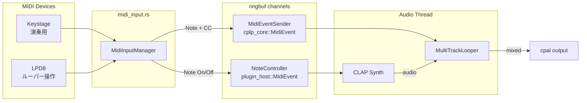
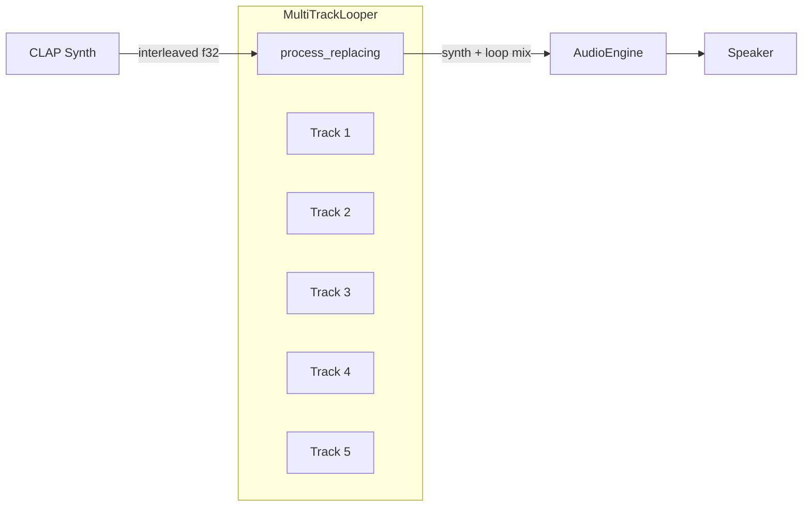
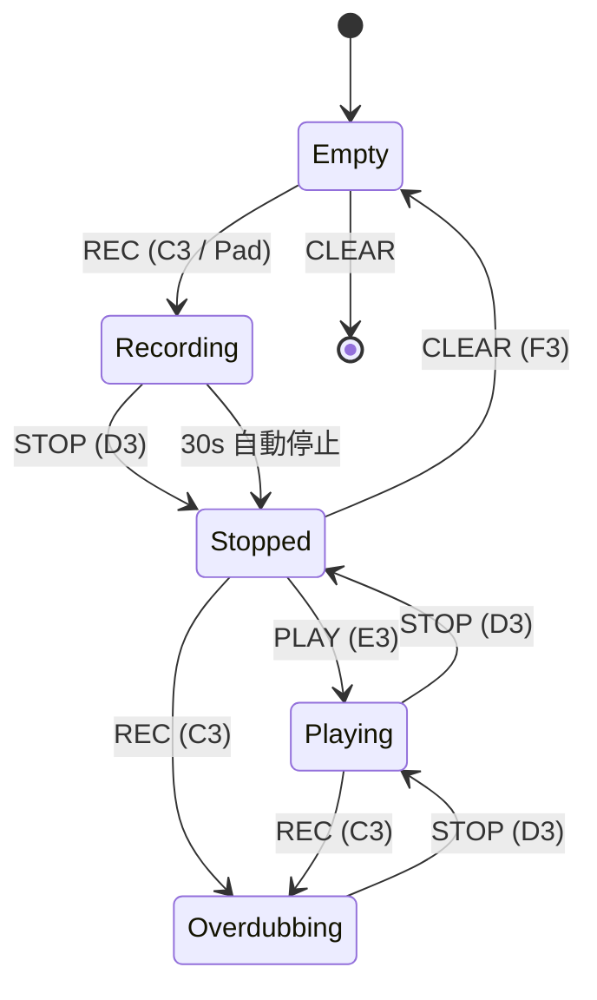

# Looper マルチトラック化 + LPD8 マッピング設計

**日付**: 2026-02-28
**ステータス**: Approved
**概要**: RC-505mkII を買わずにソフトウェアルーパーを構築。LPD8 で操作、Keystage で演奏する構成

---

## 背景

cplp-sound-system には `cplp-plug-looper` クレートに Looper モジュールが存在するが、アプリケーション（`cplp play`）には統合されていない。本設計では段階的にルーパーを統合し、最終的に LPD8（8パッド+8ノブ）でフルコントロールできるライブルーパーを構築する。

### 現状の課題

| 課題 | 詳細 |
|------|------|
| Looper 未統合 | テスト付きモジュールとして存在するのみ、`cplp play` から使えない |
| MidiEvent 2系統 | `plugin_host::MidiEvent` (struct/CLAP用) と `cplp_core::MidiEvent` (enum/AudioModule用) が別 |
| CC パースなし | `midi_input.rs` は Note On/Off のみ、CC (0xB0) を無視 |
| NoteController 制限 | `note_on`/`note_off` のみ、CC を送れない |
| 単一 audio_source | `engine.start(|data| { ... })` — 1つのクロージャで完結 |

### 設計思想

- **Phase ごとに動くものを作る** — 「作る→触る→フィードバック」サイクル
- **既存の MIDI 2系統を維持** — CLAP 用と AudioModule 用を無理に統合しない
- **lock-free 原則** — オーディオスレッドでロックを取らない

---

## アーキテクチャ

### MIDI ルーティング



### オーディオフロー



---

## Phase 1: Hello Looper — 単一ルーパーを触れるようにする

**ゴール**: シンセで弾いた音をループ録音・再生できる

### 変更点

#### 1. `plugin_host.rs` — CC サポート + MidiEventSender

```rust
// MidiEvent に CC 追加
pub struct MidiEvent {
    pub status: u8,  // 0x90=NoteOn, 0x80=NoteOff, 0xB0=CC
    pub key: u8,     // note or cc number
    pub velocity: u8, // velocity or cc value
}

// NoteController に CC メソッド追加
impl NoteController {
    pub fn control_change(&mut self, cc: u8, value: u8) { ... }
}

// cplp_core::MidiEvent 用の lock-free チャネル（新規）
pub struct MidiEventSender { producer: HeapProd<CoreMidiEvent> }
pub struct MidiEventReceiver { consumer: HeapCons<CoreMidiEvent> }
pub fn midi_event_channel(capacity: usize) -> (MidiEventSender, MidiEventReceiver);
```

#### 2. `midi_input.rs` — CC パース + デュアル送信

```rust
// connect のシグネチャ拡張
pub fn connect(
    port_index: usize,
    note_ctrl: NoteController,
    midi_event_tx: Option<MidiEventSender>,  // Looper 用（任意）
) -> Result<Self>

// handle_midi_message に CC 追加
0xB0 => midi_event_tx.control_change(cc, value)
```

#### 3. `main.rs` — --looper フラグ

```rust
Play {
    // ...既存フィールド
    #[arg(long)]
    looper: bool,  // NEW
}
```

`--looper` 指定時:
1. `Looper::new(sample_rate)` を生成
2. `midi_event_channel()` で Looper 用 MIDI チャネルを作成
3. `engine.start()` クロージャ内で `synth → looper.process_replacing()` チェイン
4. MIDI コールバックで全ノートを NoteController（シンセ）と MidiEventSender（Looper）の両方に送信

### 検証

```bash
cplp play <synth-id> --looper -m <midi-port>
# Keystage で演奏 → C3 録音 → D3 停止 → E3 再生
```

---

## Phase 2: マルチトラック — 5トラック独立操作

**ゴール**: 5つの独立ループを録音・再生

### MultiTrackLooper 設計

```rust
pub struct MultiTrackLooper {
    tracks: Vec<Looper>,       // 5 インスタンス
    active_track: usize,       // 操作対象トラック (0-4)
    sample_rate: f32,
}

impl AudioModule for MultiTrackLooper {
    fn process_replacing(&mut self, input: &[f32], output: &mut [f32]) {
        // 1. active_track に input を録音
        // 2. 全トラックの再生出力をミックス
    }

    fn handle_midi(&mut self, event: MidiEvent) {
        // active_track 方式:
        // C3=Rec, D3=Stop, E3=Play, F3=Clear → active_track に適用
        // CC で active_track 切替
    }
}
```

### トラック切替方式

| 方式 | 説明 | 採用 |
|------|------|------|
| ノート範囲振り分け | Note 60-65→Track1, 48-53→Track2... | 複雑 |
| **active_track + CC** | CC でトラック選択、操作ノートは共通 | **採用** |

CC 70 (値 0-4) でアクティブトラックを切り替え。操作ノートは Phase 1 と同じ C3-F3。

---

## Phase 3: LPD8 フルマッピング + UX

**ゴール**: LPD8 だけでルーパーをフルコントロール

### LPD8 マッピング

#### パッド (Note 36-43, Program 4 デフォルト)

| パッド | Note | 機能 |
|--------|------|------|
| Pad 1 | 36 | Track 1 Rec/Play トグル |
| Pad 2 | 37 | Track 2 Rec/Play トグル |
| Pad 3 | 38 | Track 3 Rec/Play トグル |
| Pad 4 | 39 | Track 4 Rec/Play トグル |
| Pad 5 | 40 | Track 5 Rec/Play トグル |
| Pad 6 | 41 | Stop All |
| Pad 7 | 42 | Clear All |
| Pad 8 | 43 | Undo (stretch goal) |

#### ノブ (CC 1-8)

| ノブ | CC | 機能 |
|------|-----|------|
| K1-K5 | 1-5 | Track 1-5 ゲイン |
| K6 | 6 | マスターゲイン |
| K7 | 7 | (予約) |
| K8 | 8 | (予約) |

### マルチデバイス MIDI ルーティング

```rust
// デバイス名ベースのルーティング
MidiInputManager::connect_routed(
    devices: &[MidiRouteConfig],
) -> Result<Vec<Self>>

struct MidiRouteConfig {
    name_pattern: &str,       // "LPD8" or "Keystage"
    note_ctrl: Option<NoteController>,
    midi_event_tx: Option<MidiEventSender>,
}
```

### HUD 連携

Looper 状態を HUD に表示:

| 表示項目 | データソース |
|----------|------------|
| トラック状態 | Empty/Rec/Play/Overdub アイコン |
| ループ長 | `loop_duration_secs()` |
| アクティブトラック | ハイライト表示 |
| ゲインレベル | バー表示 |

---

## 状態遷移図（全体）



---

## 技術的決定事項

| 決定 | 選択 | 理由 |
|------|------|------|
| MIDI 2系統維持 | 統合しない | CLAP の EventBuffer と AudioModule の MidiEvent は役割が異なる |
| Looper の位置 | synth の後段 | エフェクトとして処理（process_replacing） |
| トラック切替 | active_track + CC | LPD8 のパッド数に合わせた直感的操作 |
| lock-free MIDI 転送 | ringbuf | オーディオスレッドのリアルタイム制約遵守 |
| MidiEventSender/Receiver | 新規型 | NoteController は CLAP 専用のため分離 |

---

## cplp-plug-looper 依存関係

```toml
# Cargo.toml (変更なし — cplp-core のみに依存)
[dependencies]
cplp-core.workspace = true
```

## cplp-app 依存関係

```toml
# 追加
cplp-plug-looper = { path = "../cplp-plug-looper" }
```
