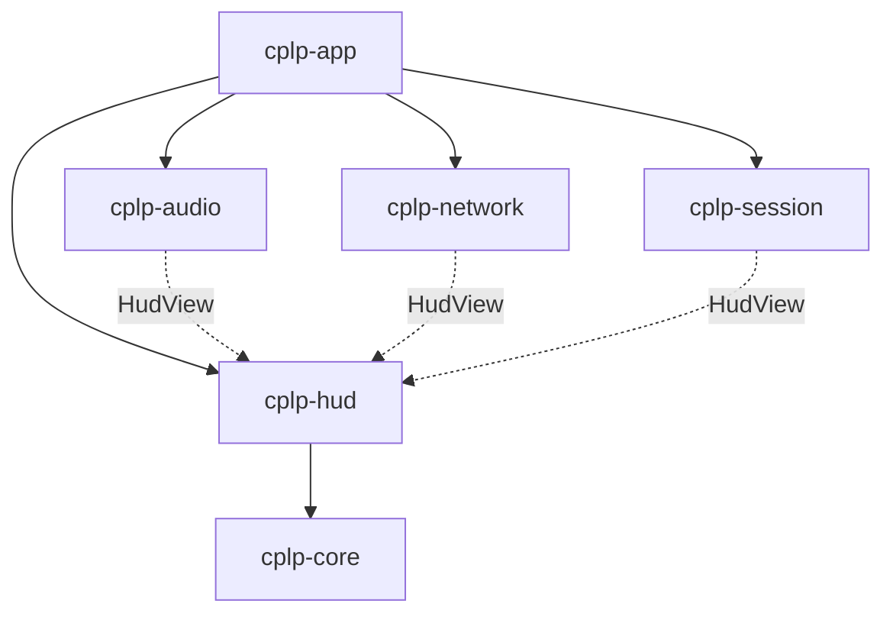
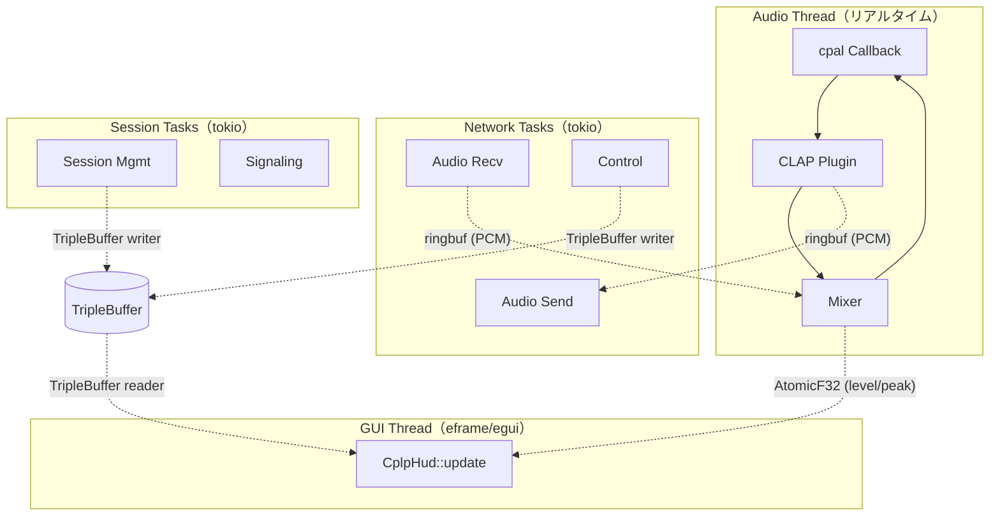

# cplp-hud GUI 設計

**日付**: 2026-02-22
**ステータス**: Approved
**概要**: ライブ演奏向けミニマル HUD を egui で構築する設計

---

## 背景

cplp-sound-system は現在 CLI のみ。ライブ演奏中に接続状態・レベル・プラグイン情報を確認するための GUI が必要。

### 検討した選択肢

| 選択肢 | 判定 | 理由 |
|---|---|---|
| Fabric (Swift) | 見送り | クリエイティブコーディング環境であり UI フレームワークではない。Rust との FFI コスト |
| SwiftUI + Rust FFI | 見送り | ネイティブ体験は良いが FFI ブリッジの実装コストが高い |
| nannou + egui | 将来候補 | ビジュアライザ追加時に再検討。ノードエディタと合わせて |
| **egui 単体 (eframe)** | **採用** | 軽量・高速・Rust 統一・ライブ HUD に最適 |

### 将来の拡張パス

```
egui HUD（今回）──→ nannou + egui（ビジュアライザ追加）──→ ノードエディタ（egui-snarl）
```

---

## 1. クレート構成

`cplp-hud` クレートをワークスペースに追加。

```
crates/cplp-hud/
└── src/
    ├── lib.rs
    ├── app.rs           # eframe アプリ本体 + 画面遷移
    ├── state.rs         # HudView, AudioMeters, SessionSnapshot
    └── widgets/
        ├── mod.rs
        ├── connection.rs    # 接続状態 + レイテンシ表示
        ├── meters.rs        # オーディオレベルメーター
        ├── mixer.rs         # ミックスバランス表示・操作
        └── plugin_info.rs   # プラグイン名表示
```

### クレート依存関係



---

## 2. データフロー

コア → HUD のデータは **lock-free の一方通行**。リアルタイムオーディオスレッドをブロックしない。

### 3 つのデータ転送パターン

| パターン | データの性質 | 構造 | クレート |
|---|---|---|---|
| ストリーム | PCM オーディオ連続データ | Ring Buffer | `ringbuf` 0.4（既存） |
| 最新値 | レベル・ピーク値 | AtomicF32 | `atomic_float` 1.x |
| スナップショット | セッション情報まるごと | Triple Buffer | `triple_buffer` 8.x |

### データフロー図

```
Audio Thread ──→ [AtomicF32] ─────────────────→ HUD (egui)
                  (level, peak)

Network Task ──→ ┐
Session Task ──→ ├→ [TripleBuffer<SessionSnapshot>] ──→ HUD
Audio Thread ──→ ┘    (latency, jitter, peer, plugin, mix)
                       ↑ 非 RT タスクが構造体を swap
```

**設計判断: なぜ 2 段構成か**

- `AtomicF32`: オーディオスレッドから直接 `store(val, Relaxed)` 1 命令。最速パス
- `TripleBuffer<SessionSnapshot>`: 読み出し時に更新がなければ atomic 操作すらゼロ（wait-free）
- レベルメーターは ~2.9ms 間隔で更新される超高頻度データ。Triple Buffer だとキャッシュライン競合のリスクがある

---

## 3. データ構造

```rust
// cplp-hud/src/state.rs

use atomic_float::AtomicF32;
use std::sync::Arc;
use std::sync::atomic::Ordering::Relaxed;
use triple_buffer::Output;

/// オーディオスレッドから直接書き込まれる（最速パス）
pub struct AudioMeters {
    pub local_level: AtomicF32,
    pub local_peak: AtomicF32,
    pub remote_level: AtomicF32,
    pub remote_peak: AtomicF32,
}

/// ネットワーク/セッション → HUD（triple buffer 経由）
pub struct SessionSnapshot {
    pub peer_name: String,
    pub connected: bool,
    pub latency_ms: f32,
    pub jitter_ms: f32,
    pub local_plugin: String,
    pub remote_plugin: String,
    pub mix_local: f32,
    pub mix_remote: f32,
}

/// HUD が毎フレーム読み出す統合ビュー
pub struct HudView {
    pub meters: Arc<AudioMeters>,
    pub session: Output<SessionSnapshot>,
}
```

---

## 4. HUD レイアウト

暗い背景に明るいインジケーター。チラ見で状態が分かるデザイン。

```
┌─────────────────────────────────────────────────┐
│                                                 │
│   ● Player B                          8.2ms    │
│   Jitter: 2.1ms                                │
│                                                 │
│   ├ You ──────────────────────────────────────  │
│   │  ██████████████░░░░  Diva          -6dB    │
│   │                                             │
│   ├ Peer ─────────────────────────────────────  │
│   │  ████████░░░░░░░░░░  Vital         -12dB   │
│   │                                             │
│   ├ Mix ──────────────────────────────────────  │
│   │  You ████████████████████░░░░░░ Peer       │
│   │              70% / 30%                      │
│   │                                             │
│   └─────────────────────────────────────────    │
│                                                 │
└─────────────────────────────────────────────────┘
```

### デザインルール

| ルール | 理由 |
|---|---|
| 暗背景（ほぼ黒） | ステージ・暗所で眩しくない |
| 接続状態は色で判断（緑●/赤●） | テキストを読まなくてもわかる |
| レベルメーターは横バー | 縦より横の方が一行に収まる |
| レイテンシは数値＋色（<10ms 緑、<20ms 黄、>20ms 赤） | 閾値を超えたら色で警告 |
| フォントは大きめモノスペース | 遠くからでも読める |
| 操作要素は最小限 | ライブ中に誤操作しない |

**操作**: ミックスバランスの調整だけ HUD 上で操作可能（ドラッグまたはスクロール）。

---

## 5. 画面遷移

同一 egui ウィンドウ内で 3 つの画面を切り替える。

```
Setup ──[Join/Create]──→ Connecting ──[P2P 確立]──→ Live
  ↑                                                   │
  └──────────────[切断/エラー]─────────────────────────┘
```

```rust
pub enum Screen {
    Setup,       // プラグイン選択、セッション作成/参加
    Connecting,  // P2P 接続待ち
    Live,        // ライブ HUD（演奏中）
}
```

### Setup 画面の要素

- CLAP プラグイン一覧（`clack-finder` でスキャン）
- セッション作成 or 参加（セッション ID 入力）
- MIDI 入力デバイス選択

### Connecting 画面の要素

- 接続先ピア名、セッション ID
- プログレスインジケーター
- キャンセルボタン

### Live 画面

- セクション 4 の HUD レイアウト

---

## 6. egui 統合

### eframe 起動設定

```rust
let options = eframe::NativeOptions {
    viewport: egui::ViewportBuilder::default()
        .with_inner_size([480.0, 320.0])
        .with_decorations(true),
    vsync: true,  // GPU 同期で省電力
    ..Default::default()
};
```

### 描画ループ

```rust
impl eframe::App for CplpHud {
    fn update(&mut self, ctx: &egui::Context, _frame: &mut eframe::Frame) {
        match self.screen {
            Screen::Setup => self.draw_setup(ctx),
            Screen::Connecting => self.draw_connecting(ctx),
            Screen::Live => {
                // lock-free 読み出し
                let session = self.view.session.read();
                let local_level = self.view.meters.local_level.load(Relaxed);
                // ... 描画 ...
                ctx.request_repaint(); // 連続描画（ライブ HUD）
            }
        }
    }
}
```

---

## 7. スレッド構成（全体像）



---

## 8. 依存クレート追加

```toml
[workspace.dependencies]
# GUI
eframe = { version = "0.30", default-features = false, features = ["wgpu"] }
egui = "0.30"

# Lock-free（追加）
atomic_float = "1"
triple_buffer = "8"

# 既存
# ringbuf = "0.4"
```

---

## 将来の拡張

| フェーズ | 内容 |
|---|---|
| v0.2 | nannou 統合でオーディオリアクティブビジュアライザ追加 |
| v0.3 | egui-snarl でノードエディタ（エフェクトチェイン編集等） |
| 検討中 | Fabric/Satin のビジュアライザ層としての活用（Swift 側） |
