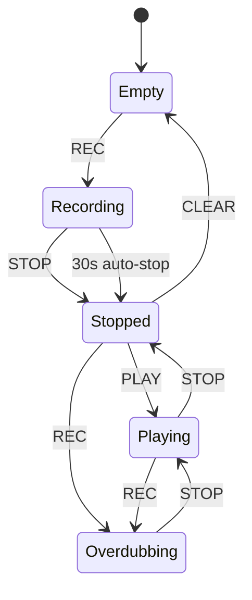

# Looper マルチトラック仕様

**日付**: 2026-02-28
**ステータス**: Approved

---

## 概要

RC-505mkII を購入せず、cplp-sound-system 上にソフトウェアルーパーを構築する。
LPD8（8パッド+8ノブ）でルーパーを操作し、Keystage で演奏する構成。

## 目的

- ライブパフォーマンスで即座にループを重ねられる環境
- ハードウェアルーパー（RC-505mkII）と同等の操作体験をソフトウェアで実現
- 既存の CLAP シンセチェインにシームレスに統合

## 要件

### 機能要件

| ID | 要件 | Phase |
|----|------|-------|
| REQ-LP-001 | シンセ出力をリアルタイムにループ録音・再生できる | 1 |
| REQ-LP-002 | MIDI ノートでルーパーの Rec/Stop/Play/Clear を制御できる | 1 |
| REQ-LP-003 | オーバーダブ（再生中に重ね録り）ができる | 1 |
| REQ-LP-004 | 最大5トラックを独立して操作できる | 2 |
| REQ-LP-005 | 全トラックの出力が自動的にミックスされる | 2 |
| REQ-LP-006 | LPD8 のパッドで各トラックの Rec/Play をトグルできる | 3 |
| REQ-LP-007 | LPD8 のノブで各トラックのゲインを調整できる | 3 |
| REQ-LP-008 | 複数 MIDI デバイスを同時接続し、デバイスごとにルーティングできる | 3 |
| REQ-LP-009 | HUD にトラック状態・ループ長・ゲインを表示できる | 3 |

### 非機能要件

| ID | 要件 |
|----|------|
| REQ-LP-NF-001 | オーディオスレッドで lock を取らない（lock-free） |
| REQ-LP-NF-002 | 最大ループ長 30 秒/トラック |
| REQ-LP-NF-003 | レイテンシ増加なし（既存の cpal バッファサイズを維持） |

## 操作マッピング

### Phase 1-2: キーボード MIDI ノート

| ノート | 操作 |
|--------|------|
| C3 (60) | Record / Overdub 開始 |
| D3 (62) | Stop |
| E3 (64) | Play |
| F3 (65) | Clear |

### Phase 3: LPD8

| パッド | Note | 機能 |
|--------|------|------|
| Pad 1-5 | 36-40 | Track 1-5 Rec/Play トグル |
| Pad 6 | 41 | Stop All |
| Pad 7 | 42 | Clear All |
| Pad 8 | 43 | Undo (stretch) |

| ノブ | CC | 機能 |
|------|-----|------|
| K1-K5 | 1-5 | Track 1-5 ゲイン |
| K6 | 6 | マスターゲイン |

## 状態遷移

