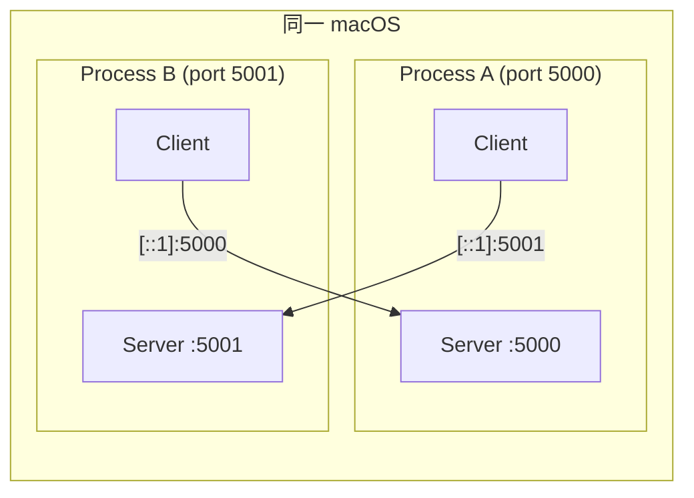

# guides/01: 開発ガイド

**最終更新**: 2026-02-20

---

## 目次

1. [前提条件](#1-前提条件)
2. [セットアップ](#2-セットアップ)
3. [ビルド](#3-ビルド)
4. [ローカルテスト](#4-ローカルテスト)
5. [CLAP プラグインのインストール](#5-clap-プラグインのインストール)
6. [トラブルシューティング](#6-トラブルシューティング)

---

## 1. 前提条件

### 1.1 システム要件

| 項目 | 要件 |
|------|------|
| OS | macOS 14+ (Sonoma 以降) |
| Rust | 1.85.0+ (edition 2024) |
| CPU | Apple Silicon または Intel |
| ネットワーク | IPv6 対応（ローカルテストでは loopback） |

### 1.2 開発ツール

```bash
# Rust ツールチェインのインストール（未インストールの場合）
curl --proto '=https' --tlsv1.2 -sSf https://sh.rustup.rs | sh

# mise 経由の場合
mise install rust@1.85
```

---

## 2. セットアップ

### 2.1 リポジトリのクローン

```bash
git clone https://github.com/mako-357/cplp-sound-system.git
cd cplp-sound-system
```

### 2.2 Unison Protocol の取得

Unison Protocol は Git 依存として `Cargo.toml` に指定されている。初回ビルド時に自動取得される。

```toml
# Cargo.toml (ワークスペースルート)
[workspace.dependencies]
unison-protocol = { git = "https://github.com/mako-357/unison", package = "unison-protocol" }
```

---

## 3. ビルド

### 3.1 基本ビルド

```bash
# デバッグビルド
cargo build

# リリースビルド（オーディオ処理のパフォーマンス検証用）
cargo build --release

# 全クレートのテスト
cargo test --workspace
```

### 3.2 clippy

```bash
cargo clippy --workspace -- -D warnings
```

---

## 4. ローカルテスト

### 4.1 2 プロセス起動テスト（MVP）

同一マシン上で 2 つのプロセスを起動し、ループバック接続でテストする。

**ターミナル 1（Player A）**:
```bash
cargo run -- listen --port 5000
```

**ターミナル 2（Player B）**:
```bash
cargo run -- connect [::1]:5000
```

### 4.2 テスト構成図



### 4.3 LAN テスト

2 台の macOS で直接テストする場合:

**macOS A**:
```bash
# 自分の IPv6 アドレスを確認
ifconfig en0 | grep inet6

# 起動
cargo run -- listen --port 5000
```

**macOS B**:
```bash
# Player A の IPv6 アドレスを指定して接続
cargo run -- connect "fe80::xxxx:xxxx:xxxx:xxxx%en0":5000
```

---

## 5. CLAP プラグインのインストール

### 5.1 CLAP プラグインとは

CLAP (CLever Audio Plugin) は次世代のオーディオプラグインフォーマット。VST3 の後継として設計され、Rust との親和性が高い。

### 5.2 インストールパス

macOS での CLAP プラグインのインストール先:

```
# ユーザーローカル
~/Library/Audio/Plug-Ins/CLAP/

# システムワイド
/Library/Audio/Plug-Ins/CLAP/
```

### 5.3 無料の CLAP プラグイン例

| プラグイン | 種類 | 配布元 |
|-----------|------|--------|
| Surge XT | シンセサイザー | [surge-synthesizer.github.io](https://surge-synthesizer.github.io) |
| Vital | シンセサイザー | [vital.audio](https://vital.audio) |
| Dexed | FM シンセサイザー | [asb2m10/dexed](https://github.com/asb2m10/dexed) |

### 5.4 プラグインの確認

```bash
# インストール済み CLAP プラグインの一覧
ls ~/Library/Audio/Plug-Ins/CLAP/
ls /Library/Audio/Plug-Ins/CLAP/
```

---

## 6. トラブルシューティング

### 6.1 ビルドエラー

| エラー | 原因 | 対処 |
|--------|------|------|
| `edition 2024 not supported` | Rust バージョンが古い | `rustup update` で 1.85+ に更新 |
| `cpal: no audio backend` | macOS オーディオ権限 | システム設定 > プライバシー > マイク |
| `clack-host build error` | clang / Xcode 未インストール | `xcode-select --install` |

### 6.2 オーディオの問題

| 症状 | 原因 | 対処 |
|------|------|------|
| 音が出ない | 出力デバイス未選択 | macOS 音声設定でデバイスを確認 |
| ノイズ・グリッチ | バッファサイズが小さすぎる | バッファサイズを 256 に増加 |
| 高レイテンシ | WiFi 使用 | 有線 LAN に切り替え |

### 6.3 ネットワークの問題

| 症状 | 原因 | 対処 |
|------|------|------|
| 接続できない | ファイアウォール | macOS ファイアウォールで UDP を許可 |
| IPv6 エラー | IPv6 未有効 | ネットワーク設定で IPv6 を確認 |
| タイムアウト | ポート不一致 | `--port` オプションを確認 |

---

### 関連ドキュメント

- [spec/01: コアコンセプト](../spec/01-core-concept.md) -- プロジェクト概要
- [design/01: アーキテクチャ](../design/01-architecture.md) -- 全体設計

---

**最終更新**: 2026-02-20
