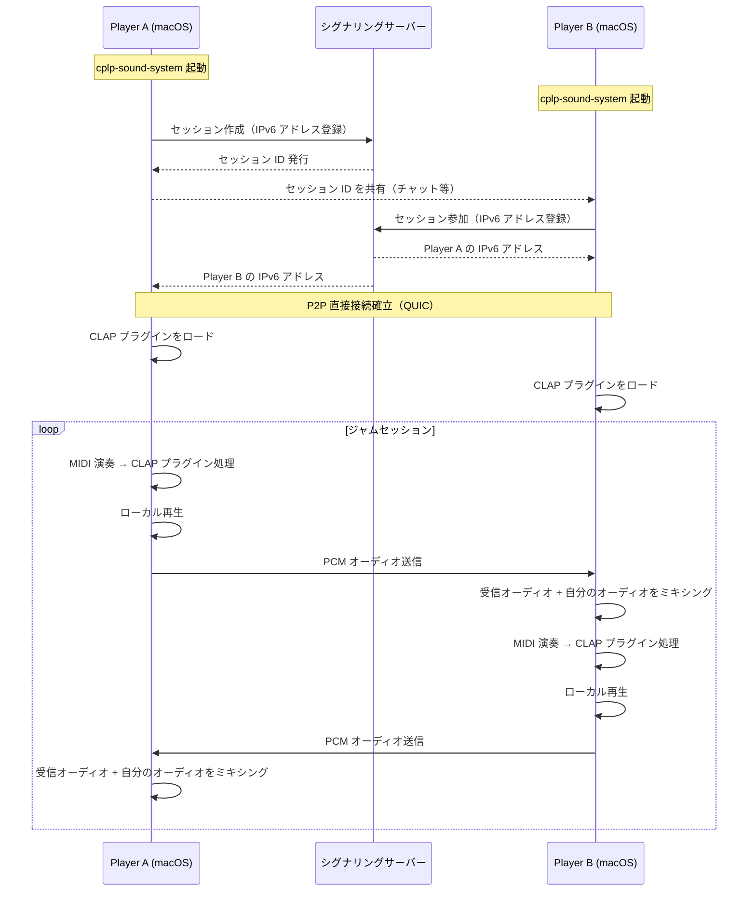
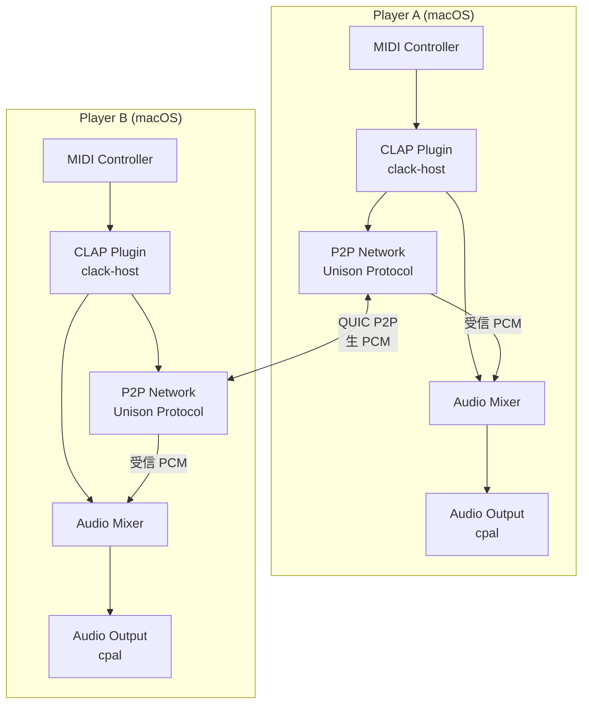

# spec/01: cplp-sound-system コアコンセプト仕様

**バージョン**: 0.1.0-draft
**最終更新**: 2026-02-20
**ステータス**: Draft

---

## 目次

1. [ビジョン](#1-ビジョン)
2. [ユーザーストーリー](#2-ユーザーストーリー)
3. [システム概要](#3-システム概要)
4. [要件一覧](#4-要件一覧)
5. [スコープ](#5-スコープ)
6. [関連ドキュメント](#6-関連ドキュメント)

---

## 1. ビジョン

### 1.1 なぜ P2P ジャムセッションか

音楽の共同演奏（ジャムセッション）は、本来「同じ場所にいる」ことが前提だった。既存のリモート音楽コラボレーションツールは、サーバー経由のルーティングにより不可避なレイテンシが発生し、リアルタイム性が損なわれる。

cplp-sound-system は、**2台の macOS を P2P で直接接続**し、サーバーを介さないことでレイテンシを最小化する。各プレイヤーは CLAP プラグインを音源とし、演奏した音がリアルタイムで相手に届く体験を実現する。

### 1.2 プロジェクト名の由来

**CPLP** = **C**LAP **P**lugin **L**ive **P**erformance

CLAP プラグインをライブパフォーマンスのコンテキストで使うことを表現している。

### 1.3 コア原則

| 原則 | 説明 |
|------|------|
| **P2P ファースト** | サーバーを経由しない直接接続。シグナリングサーバーはアドレス交換のみ |
| **レイテンシ最優先** | エンドツーエンド <20ms（LAN）を目標 |
| **CLAP ネイティブ** | CLAP プラグインホスティングを前提とした設計 |
| **対等接続** | サーバー/クライアントの区別なし。両者が同じ機能を持つ |

---

## 2. ユーザーストーリー

### 2.1 基本シナリオ: 2人のミュージシャンのジャムセッション

### 2.2 ユーザー体験フロー

1. **起動**: アプリを起動し、使用する CLAP プラグインを選択
2. **接続**: セッションを作成（または既存セッションに参加）
3. **演奏**: MIDI コントローラーで演奏。自分の音と相手の音の両方が聴こえる
4. **切り替え**: セッション中にプラグインを切り替え可能
5. **終了**: セッションを終了し、P2P 接続を切断

### 2.3 MVP での体験

> Player A が CLAP シンセプラグインをロードし、MIDI キーボードで演奏する。
> Player B も同様にプラグインをロードして演奏する。
> 互いの演奏がリアルタイムで聴こえ、まるで同じ部屋にいるかのようにジャムセッションできる。

---

## 3. システム概要

### 3.1 システム構成図

### 3.2 技術スタック

| 層 | 技術 | 用途 |
|-----|------|------|
| 言語 | Rust | システムプログラミング、リアルタイム処理 |
| オーディオ I/O | cpal | クロスプラットフォームオーディオ入出力 |
| プラグインホスト | clack-host | CLAP プラグインのホスティング |
| ネットワーク | Unison Protocol | QUIC ベースの P2P 通信 |
| 非同期ランタイム | tokio | ネットワーク・制御の非同期処理 |
| プラットフォーム | macOS | ターゲット OS |

### 3.3 データフォーマット

| データ | フォーマット | 説明 |
|--------|------------|------|
| オーディオ | 生 PCM (f32) | 無圧縮。レイテンシ最優先 |
| 制御メッセージ | JSON over QUIC | セッション制御、メタデータ |
| プロトコル定義 | KDL | Unison Protocol スキーマ |

---

## 4. 要件一覧

### 4.1 コア要件

| REQ-ID | 要件 | 優先度 | 受け入れ条件 |
|--------|------|--------|------------|
| REQ-CORE-001 | 2台の macOS 間でフルデュプレックスオーディオストリーミング | Must | 双方向で同時にオーディオデータが流れること |
| REQ-CORE-002 | エンドツーエンドレイテンシ <20ms（LAN 環境） | Must | ローカルネットワークで計測し 20ms 以下 |
| REQ-CORE-003 | 生 PCM オーディオデータの送受信 | Must | f32 サンプルを無圧縮で転送 |

### 4.2 オーディオ要件

| REQ-ID | 要件 | 優先度 | 受け入れ条件 |
|--------|------|--------|------------|
| REQ-AUDIO-001 | CLAP プラグインのホスティング（clack-host） | Must | CLAP プラグインをロード・実行できること |
| REQ-AUDIO-002 | ローカル再生とリモート送信の同時処理 | Must | 演奏した音を自分で聴きながら相手にも送信 |
| REQ-AUDIO-003 | 相手のオーディオと自分のオーディオのミキシング | Must | 両方の音が適切にミックスされて出力 |

### 4.3 ネットワーク要件

| REQ-ID | 要件 | 優先度 | 受け入れ条件 |
|--------|------|--------|------------|
| REQ-NET-001 | Unison Protocol による対等 P2P 接続 | Must | サーバー/クライアントの区別なく接続 |
| REQ-NET-002 | シグナリングサーバーによる IPv6 アドレス交換 | Must | IPv6 アドレスの相互通知が完了すること |
| REQ-NET-003 | QUIC 上の独立チャネルによるオーディオ/コントロール分離 | Must | オーディオとコントロールが独立して動作 |

### 4.4 セッション要件

| REQ-ID | 要件 | 優先度 | 受け入れ条件 |
|--------|------|--------|------------|
| REQ-SESSION-001 | セッション作成・参加のワークフロー | Must | セッション ID でピアが参加できること |
| REQ-SESSION-002 | セッション中のプラグイン切り替え | Should | セッション中断なくプラグインを変更 |

### 4.5 要件トレーサビリティマトリクス

| REQ-ID | 仕様文書 | 設計文書 | 実装（予定） | テスト（予定） |
|--------|---------|---------|------------|--------------|
| REQ-CORE-001 | spec/01, spec/02 | design/01 | - | - |
| REQ-CORE-002 | spec/01, spec/02 | design/01 | - | - |
| REQ-CORE-003 | spec/01, spec/02 | design/01 | - | - |
| REQ-AUDIO-001 | spec/02 | design/01 | - | - |
| REQ-AUDIO-002 | spec/02 | design/01 | - | - |
| REQ-AUDIO-003 | spec/02 | design/01 | - | - |
| REQ-NET-001 | spec/03 | design/01, design/02 | - | - |
| REQ-NET-002 | spec/03 | design/02 | - | - |
| REQ-NET-003 | spec/03 | design/01, design/02 | - | - |
| REQ-SESSION-001 | spec/03 | design/01 | - | - |
| REQ-SESSION-002 | spec/01 | design/01 | - | - |

---

## 5. スコープ

### 5.1 MVP スコープ（v0.1）

- CLAP プラグインをロードして演奏
- LAN 内での P2P 直接接続
- フルデュプレックス PCM ストリーミング
- 基本的なミキシング（自分 + 相手）

### 5.2 将来のスコープ

- WAN 対応（NAT traversal、STUN/TURN）
- マルチピア（3人以上のセッション）
- オーディオ圧縮（Opus 等）による帯域最適化
- エフェクトチェイン（複数プラグインの直列接続）
- セッション録音

### 5.3 スコープ外

- VST3 プラグインサポート（CLAP のみ）
- Windows / Linux 対応（macOS のみ）
- 映像ストリーミング
- DAW 機能（タイムライン、トラック管理等）

---

## 6. 関連ドキュメント

### 仕様書

- [spec/02: オーディオパイプライン仕様](02-audio-pipeline.md) -- オーディオ処理の詳細
- [spec/03: P2P プロトコル仕様](03-p2p-protocol.md) -- ネットワーク通信の詳細

### 設計書

- [design/01: 全体アーキテクチャ](../design/01-architecture.md) -- システム設計
- [design/02: P2P 接続設計](../design/02-p2p-connection.md) -- デュアルロール P2P の実装設計

### ガイド

- [guides/01: 開発ガイド](../guides/01-getting-started.md) -- ビルドと実行方法

### 外部参照

- [Unison Protocol](https://github.com/mako-357/unison) -- ベースとなる通信プロトコル
- [clack](https://github.com/prokopyl/clack) -- CLAP プラグインホスティング
- [cpal](https://github.com/RustAudio/cpal) -- クロスプラットフォームオーディオ

---

**仕様バージョン**: 0.1.0-draft
**最終更新**: 2026-02-20
**ステータス**: Draft
