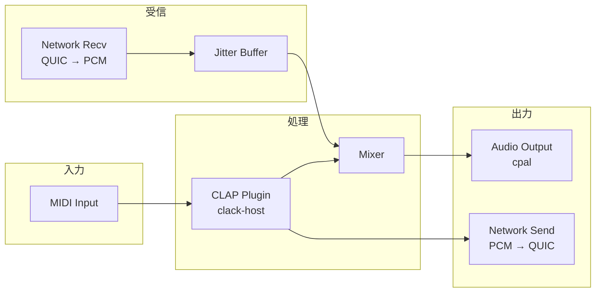
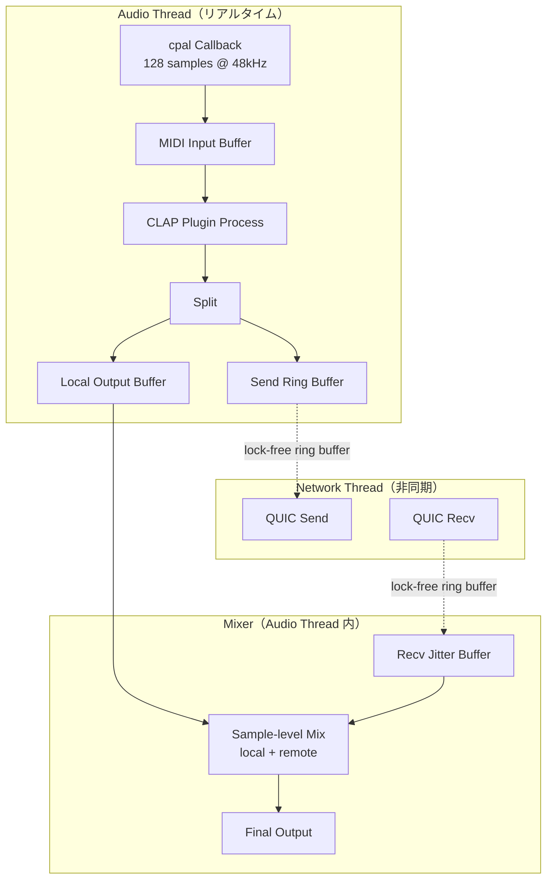

# spec/02: オーディオパイプライン仕様

**バージョン**: 0.1.0-draft
**最終更新**: 2026-02-20
**ステータス**: Draft

---

## 目次

1. [概要](#1-概要)
2. [オーディオパラメータ](#2-オーディオパラメータ)
3. [CLAP プラグインホスティング](#3-clap-プラグインホスティング)
4. [オーディオパイプライン](#4-オーディオパイプライン)
5. [ミキシング仕様](#5-ミキシング仕様)
6. [レイテンシバジェット](#6-レイテンシバジェット)
7. [関連要件](#7-関連要件)

---

## 1. 概要

cplp-sound-system のオーディオパイプラインは、CLAP プラグインで生成されたオーディオを、ローカル出力とリモート送信の両方に分配する。同時に、リモートピアから受信したオーディオとローカルオーディオをミキシングして出力する。



---

## 2. オーディオパラメータ

### 2.1 基本パラメータ

| パラメータ | デフォルト値 | 備考 |
|-----------|------------|------|
| サンプルレート | 48,000 Hz | CLAP プラグイン標準、音楽制作品質 |
| バッファサイズ | 128 samples | レイテンシ最小化（~2.67ms @ 48kHz） |
| ビット深度 | f32 (32-bit float) | CLAP/cpal 標準フォーマット |
| チャネル数 | 2 (Stereo) | L/R ステレオ |

### 2.2 ネットワーク転送時のデータサイズ

```
1 バッファ = 128 samples × 2 ch × 4 bytes (f32)
           = 1,024 bytes

1 秒あたり = 48,000 / 128 = 375 バッファ
           = 375 × 1,024 = 384,000 bytes/sec
           ≈ 375 KB/s（片方向）
           ≈ 750 KB/s（双方向）
           ≈ 3 Mbps（双方向）
```

### 2.3 ネゴシエーション

セッション開始時にピア間でパラメータを合意する。不一致時は低い方に合わせる。

| パラメータ | ネゴシエーション戦略 |
|-----------|-------------------|
| サンプルレート | 一致必須（不一致時はエラー） |
| バッファサイズ | 送信側のバッファサイズを使用 |
| チャネル数 | 一致必須（ステレオ固定） |

---

## 3. CLAP プラグインホスティング

### 3.1 clack-host の役割

[clack-host](https://github.com/prokopyl/clack) を使用して CLAP プラグインをホスティングする。


### 3.2 プラグインライフサイクル

```mermaid
stateDiagram-v2
    [*] --> Loaded: PluginBundle::load(path)
    Loaded --> Created: factory.create()
    Created --> Activated: instance.activate(sample_rate, buffer_size)
    Activated --> Processing: processor.start_processing()
    Processing --> Processing: process(audio_buffers)
    Processing --> Activated: stop_processing()
    Activated --> Created: deactivate()
    Created --> [*]: destroy()
```

### 3.3 プラグインインターフェース

cplp-sound-system がプラグインに期待するインターフェース:

| 操作 | 説明 | 関連要件 |
|------|------|---------|
| スキャン | インストール済み CLAP プラグインの一覧取得 | REQ-AUDIO-001 |
| ロード | 選択されたプラグインのロードと初期化 | REQ-AUDIO-001 |
| プロセス | MIDI 入力 → オーディオ出力の処理 | REQ-AUDIO-001 |
| 切り替え | セッション中のプラグイン切り替え | REQ-SESSION-002 |

### 3.4 CLAP プラグイン検索パス (macOS)

```
~/Library/Audio/Plug-Ins/CLAP/
/Library/Audio/Plug-Ins/CLAP/
```

---

## 4. オーディオパイプライン

### 4.1 処理フロー詳細



### 4.2 スレッド間通信

オーディオスレッドはリアルタイム制約があるため、ロックフリーデータ構造を使用する。

| 通信路 | データ構造 | 方向 |
|--------|-----------|------|
| Audio → Network (送信) | Lock-free Ring Buffer | プラグイン出力 → QUIC 送信 |
| Network → Audio (受信) | Lock-free Ring Buffer + Jitter Buffer | QUIC 受信 → ミキサー入力 |
| Control → Audio | Lock-free Channel | プラグイン切り替え、パラメータ変更 |

---

## 5. ミキシング仕様

### 5.1 ミキシング方式

シンプルな加算ミキシング。各ソースにゲインを適用し、サンプルレベルで加算する。

```
output[i] = clamp(local[i] * local_gain + remote[i] * remote_gain, -1.0, 1.0)
```

### 5.2 パラメータ

| パラメータ | デフォルト | 範囲 | 説明 |
|-----------|----------|------|------|
| local_gain | 1.0 | 0.0 - 2.0 | ローカルオーディオのゲイン |
| remote_gain | 1.0 | 0.0 - 2.0 | リモートオーディオのゲイン |

### 5.3 ジッタバッファ

ネットワークジッタを吸収するためのバッファ。

| パラメータ | デフォルト | 説明 |
|-----------|----------|------|
| バッファ深度 | 2-4 バッファ | 256-512 samples（~5-10ms @ 48kHz） |
| アンダーラン時 | 無音挿入 | バッファが空の場合はゼロフィル |
| オーバーラン時 | 最古のバッファを破棄 | 古いデータを捨てて遅延蓄積を防止 |

---

## 6. レイテンシバジェット

### 6.1 目標: <20ms（LAN 環境）

REQ-CORE-002 の達成に向けたレイテンシバジェット:

```
入力処理:      ~2.7ms  (128 samples @ 48kHz — cpal バッファ)
CLAP 処理:     ~2.7ms  (128 samples — プラグイン処理)
パケット化:    ~0.1ms  (f32 → バイト列変換)
ネットワーク:  ~1-5ms  (QUIC/LAN — RTT/2)
ジッタバッファ: ~5.3ms  (2 バッファ = 256 samples)
出力処理:      ~2.7ms  (128 samples — cpal 出力バッファ)
─────────────────────────────
合計:          ~14-19ms
```

### 6.2 バジェット分解図

```mermaid
gantt
    title レイテンシバジェット（<20ms 目標）
    dateFormat X
    axisFormat %L ms

    section Player A
    cpal入力バッファ     :a1, 0, 3
    CLAPプラグイン処理   :a2, 3, 3

    section Network
    パケット化           :n1, 6, 1
    QUIC送信 (LAN)       :n2, 7, 3
    ジッタバッファ       :n3, 10, 5

    section Player B
    cpal出力バッファ     :b1, 15, 3
```



### 6.3 チューニングポイント

| 要素 | レイテンシ削減手段 | トレードオフ |
|------|-----------------|------------|
| バッファサイズ | 128 → 64 samples | CPU 負荷増大、グリッチリスク |
| ジッタバッファ | 2 → 1 バッファ | ドロップアウトリスク増大 |
| ネットワーク | 有線 LAN 使用 | WiFi では不安定 |

---

## 7. 関連要件

| REQ-ID | 本仕様での対応箇所 |
|--------|------------------|
| REQ-CORE-001 | セクション 4: フルデュプレックスパイプライン |
| REQ-CORE-002 | セクション 6: レイテンシバジェット |
| REQ-CORE-003 | セクション 2: f32 PCM フォーマット |
| REQ-AUDIO-001 | セクション 3: CLAP プラグインホスティング |
| REQ-AUDIO-002 | セクション 4: Split による同時処理 |
| REQ-AUDIO-003 | セクション 5: ミキシング仕様 |

---

### 関連ドキュメント

- [spec/01: コアコンセプト](01-core-concept.md) -- プロジェクト全体像と要件
- [spec/03: P2P プロトコル](03-p2p-protocol.md) -- ネットワーク通信仕様
- [design/01: アーキテクチャ](../design/01-architecture.md) -- 全体設計

---

**仕様バージョン**: 0.1.0-draft
**最終更新**: 2026-02-20
**ステータス**: Draft
