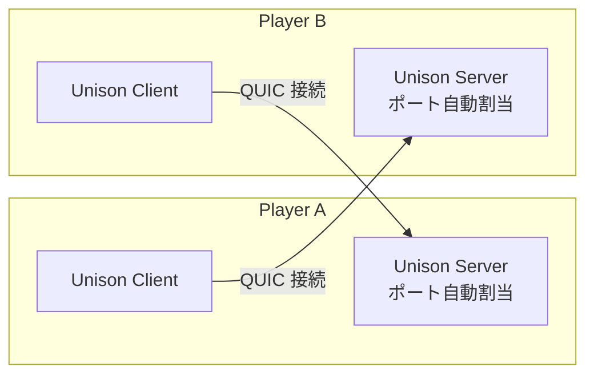
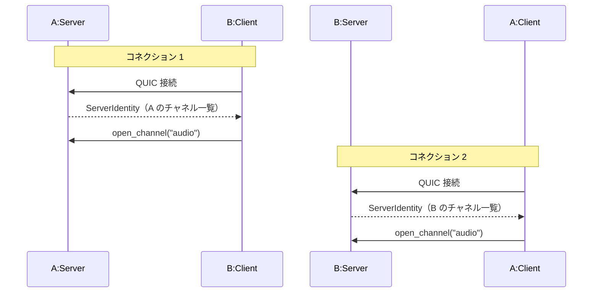
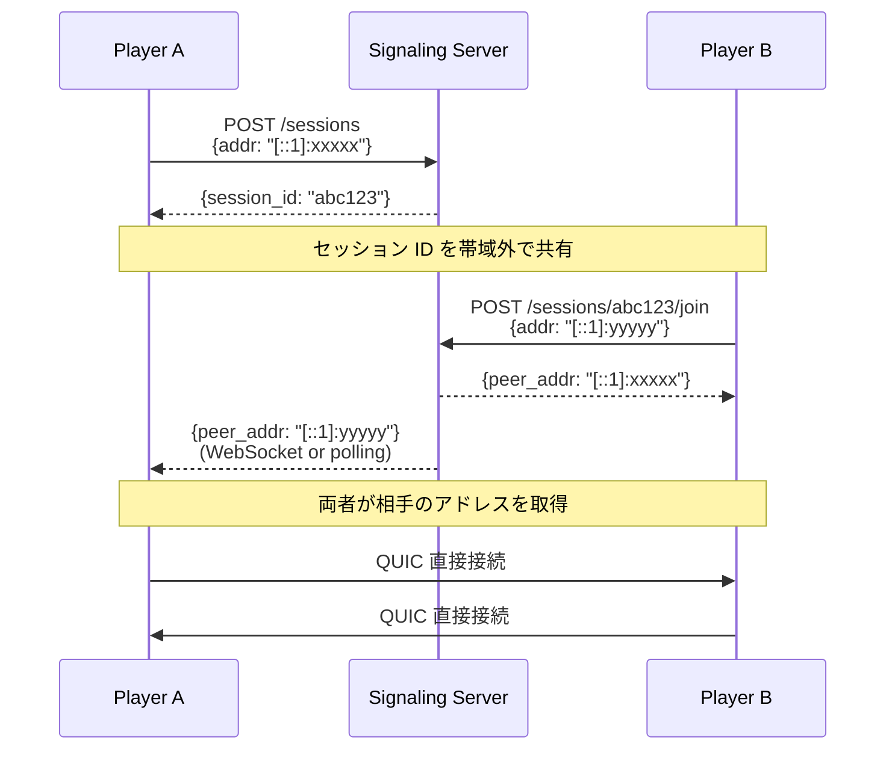
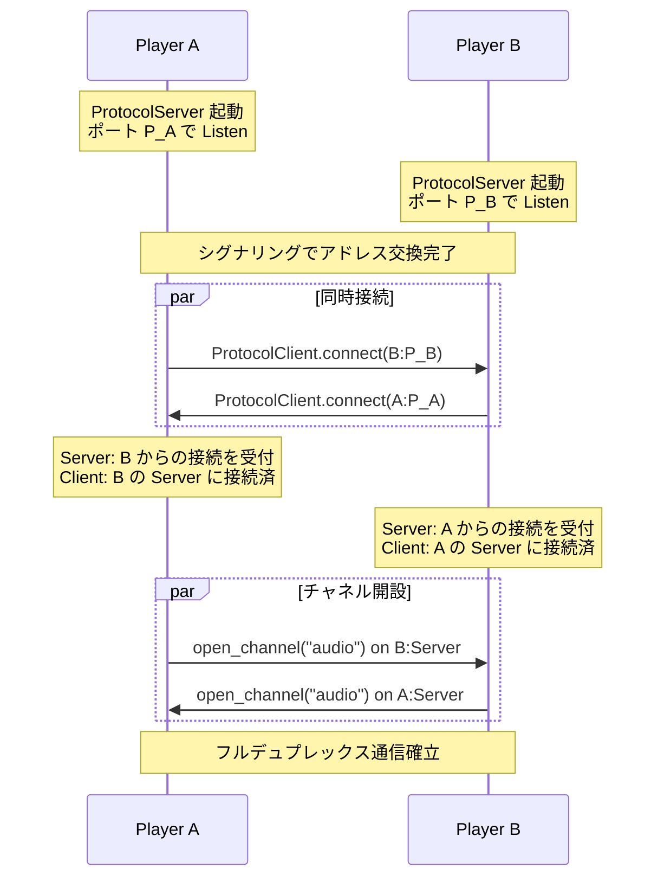
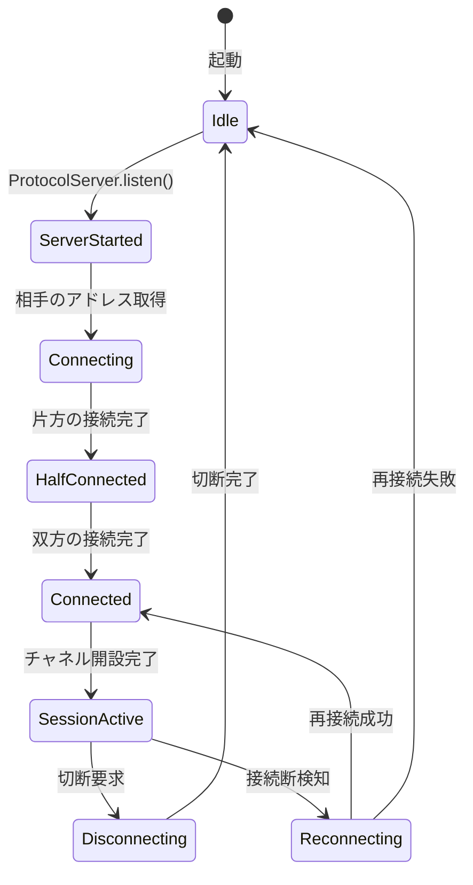
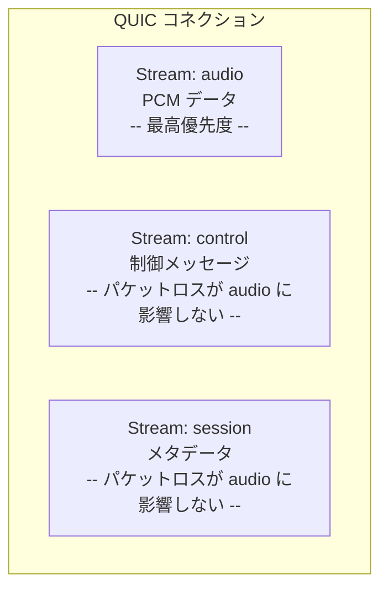
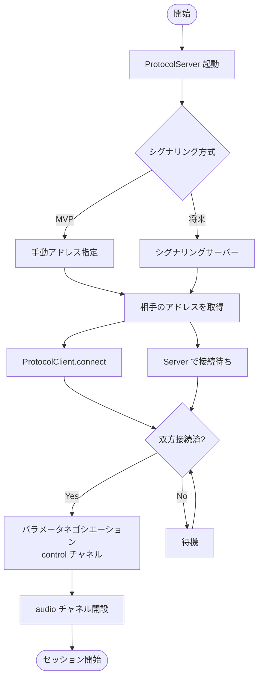
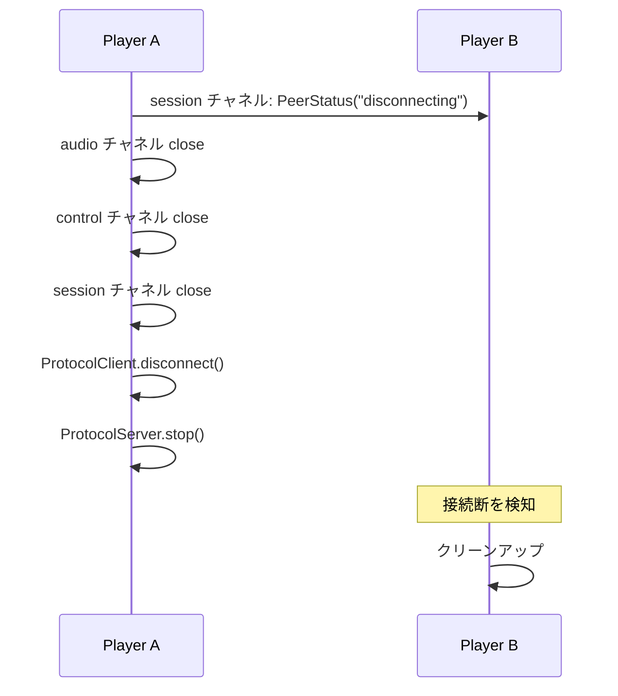

# spec/03: P2P プロトコル仕様

**バージョン**: 0.1.0-draft
**最終更新**: 2026-02-20
**ステータス**: Draft

---

## 目次

1. [概要](#1-概要)
2. [対等 P2P トポロジー](#2-対等-p2p-トポロジー)
3. [シグナリングフロー](#3-シグナリングフロー)
4. [デュアルロール接続](#4-デュアルロール接続)
5. [チャネル構成](#5-チャネル構成)
6. [接続ライフサイクル](#6-接続ライフサイクル)
7. [オーディオストリーミングプロトコル](#7-オーディオストリーミングプロトコル)
8. [関連要件](#8-関連要件)

---

## 1. 概要

cplp-sound-system の P2P 通信は、Unison Protocol をライブラリとして活用し、各ピアが **ProtocolServer + ProtocolClient のデュアルロール** で動作する。Unison Protocol 自体は変更せず、cplp-sound-system 側で P2P 接続ロジックを実装する。

### 1.1 設計方針

| 方針 | 説明 |
|------|------|
| **Unison はライブラリ** | Unison Protocol の Server/Client 機能をそのまま使う。上流への変更不要 |
| **デュアルロール** | 各ピアが Server と Client の両方を同時に持つ |
| **シグナリングは最小限** | IPv6 アドレス交換のみ。以降は直接 P2P |
| **QUIC ネイティブ** | TLS 1.3 暗号化、独立ストリームによる HoL Blocking 排除 |

---

## 2. 対等 P2P トポロジー

### 2.1 トポロジー定義



各ピアは以下の 2 つの QUIC コネクションを持つ:

| コネクション | 方向 | 用途 |
|-------------|------|------|
| 自分の Client → 相手の Server | 出力 | 自分のオーディオを相手に送る |
| 相手の Client → 自分の Server | 入力 | 相手のオーディオを受け取る |

### 2.2 なぜデュアルロールか

Unison Protocol は Server → Client への Identity 送信でチャネル構成を通知する設計。この仕組みをそのまま活かし、各ピアが相手に「自分が提供するチャネル」を通知する。



---

## 3. シグナリングフロー

### 3.1 シグナリングサーバーの役割

シグナリングサーバーは **IPv6 アドレスとポートの交換のみ** を担当する。オーディオデータは一切経由しない。



### 3.2 シグナリング API（最小構成）

| エンドポイント | メソッド | 説明 |
|---------------|---------|------|
| `POST /sessions` | Create | セッション作成。自分のアドレスを登録 |
| `GET /sessions/:id` | Read | セッション情報取得 |
| `POST /sessions/:id/join` | Join | セッションに参加。自分のアドレスを登録 |
| `WS /sessions/:id/events` | Events | ピア参加通知の WebSocket |

### 3.3 シグナリングメッセージ

```kdl
// セッション作成リクエスト
session-create {
    addr "[::1]:12345"
    name "Player A"
}

// セッション参加リクエスト
session-join {
    session_id "abc123"
    addr "[::1]:23456"
    name "Player B"
}

// ピア通知（WebSocket イベント）
peer-joined {
    addr "[::1]:23456"
    name "Player B"
}
```

### 3.4 MVP でのシグナリング

MVP ではシグナリングサーバーを省略し、**コマンドライン引数で相手のアドレスを直接指定** する。

```bash
# Player A: サーバーを起動して待機
cplp-sound-system listen --port 5000

# Player B: Player A に接続
cplp-sound-system connect [::1]:5000
```

---

## 4. デュアルロール接続

### 4.1 接続確立シーケンス



### 4.2 接続状態管理



---

## 5. チャネル構成

### 5.1 KDL スキーマ定義

各ピアの ProtocolServer が以下のチャネルを公開する:

```kdl
protocol "cplp-session" version="1.0.0" {
    namespace "club.chronista.cplp"
    description "CLAP Plugin Live Performance - P2P Session"

    // オーディオチャネル: 生 PCM ストリーミング
    // 最低レイテンシが求められる
    channel "audio" direction="bidirectional" lifetime="persistent" {
        // オーディオデータは生バイト列として送信（JSON オーバーヘッド回避）
        // フォーマット: f32 samples × channels
    }

    // コントロールチャネル: セッション制御
    channel "control" direction="bidirectional" lifetime="persistent" {
        request "SetBufferSize" {
            field "size" type="u32"
            returns "Ack" {
                field "accepted" type="bool"
            }
        }
        request "SetSampleRate" {
            field "rate" type="u32"
            returns "Ack" {
                field "accepted" type="bool"
            }
        }
        event "LatencyReport" {
            field "rtt_us" type="u64"
            field "jitter_us" type="u64"
        }
    }

    // セッションチャネル: メタデータ交換
    channel "session" direction="bidirectional" lifetime="persistent" {
        request "PluginInfo" {
            field "name" type="string"
            field "vendor" type="string"
            returns "Ack" {
                field "received" type="bool"
            }
        }
        event "PeerStatus" {
            field "status" type="string"
        }
        event "PluginChanged" {
            field "name" type="string"
            field "vendor" type="string"
        }
    }
}
```

### 5.2 チャネル一覧

| チャネル | 方向 | データ形式 | 用途 | 関連要件 |
|---------|------|-----------|------|---------|
| `audio` | 双方向 | 生バイト列 (f32 PCM) | オーディオストリーミング | REQ-CORE-001, REQ-CORE-003 |
| `control` | 双方向 | JSON (Request/Response) | パラメータネゴシエーション、レイテンシ監視 | REQ-NET-003 |
| `session` | 双方向 | JSON (Request/Event) | プラグイン情報、ピア状態 | REQ-SESSION-001, REQ-SESSION-002 |

### 5.3 チャネル分離の意義

QUIC の独立ストリームにより、各チャネルは独立した HoL Blocking 境界を持つ（REQ-NET-003）。



---

## 6. 接続ライフサイクル

### 6.1 セッション作成・参加フロー



### 6.2 切断フロー



---

## 7. オーディオストリーミングプロトコル

### 7.1 パケットフォーマット

オーディオチャネルでは、JSON オーバーヘッドを回避するため、生バイト列でオーディオデータを送信する。

```
┌──────────────────────────────────────────┐
│ Audio Packet                             │
├──────────┬──────────┬───────────────────┤
│ seq: u32 │ ts: u64  │ PCM data: [f32]   │
│ 4 bytes  │ 8 bytes  │ 1024 bytes        │
│          │          │ (128 samples × 2ch │
│          │          │  × 4 bytes)        │
├──────────┴──────────┴───────────────────┤
│ Total: 1,036 bytes per packet           │
└──────────────────────────────────────────┘
```

| フィールド | 型 | サイズ | 説明 |
|-----------|-----|--------|------|
| `seq` | u32 | 4 bytes | シーケンス番号（パケットロス検知、順序復元） |
| `ts` | u64 | 8 bytes | タイムスタンプ（サンプル単位、同期用） |
| `pcm_data` | [f32] | 可変 | PCM オーディオデータ |

### 7.2 パケットロス対策

| 方式 | 説明 |
|------|------|
| 検知 | シーケンス番号の欠番で検知 |
| 対策 | 再送しない（リアルタイム性優先）。欠番バッファは無音で埋める |
| 報告 | control チャネルの LatencyReport でパケットロス率を報告 |

---

## 8. 関連要件

| REQ-ID | 本仕様での対応箇所 |
|--------|------------------|
| REQ-NET-001 | セクション 2, 4: デュアルロール P2P |
| REQ-NET-002 | セクション 3: シグナリングフロー |
| REQ-NET-003 | セクション 5: チャネル構成と HoL Blocking 排除 |
| REQ-SESSION-001 | セクション 6: セッション作成・参加フロー |
| REQ-SESSION-002 | セクション 5: session チャネルの PluginChanged イベント |
| REQ-CORE-001 | セクション 7: フルデュプレックスオーディオストリーミング |
| REQ-CORE-003 | セクション 7: 生 PCM パケットフォーマット |

---

### 関連ドキュメント

- [spec/01: コアコンセプト](01-core-concept.md) -- プロジェクト全体像と要件
- [spec/02: オーディオパイプライン](02-audio-pipeline.md) -- オーディオ処理仕様
- [design/01: アーキテクチャ](../design/01-architecture.md) -- 全体設計
- [design/02: P2P 接続設計](../design/02-p2p-connection.md) -- デュアルロール P2P の実装設計

---

**仕様バージョン**: 0.1.0-draft
**最終更新**: 2026-02-20
**ステータス**: Draft
